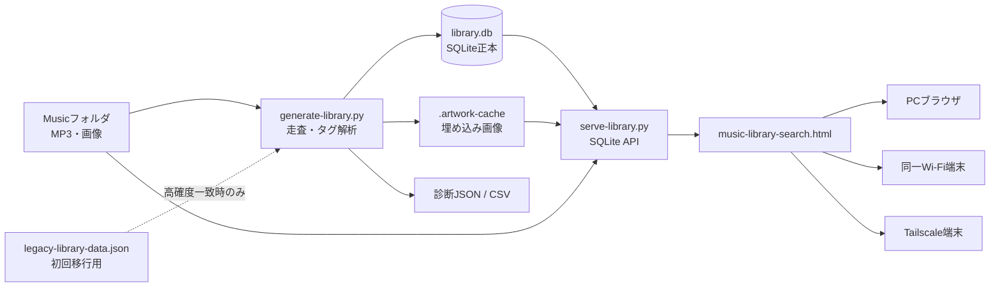

# MP3 Source Music Library v2.4

手元のMP3ファイルを正本として、タグ・アートワーク・再生回数・表記補正をSQLiteで管理し、ブラウザから検索・再生する個人向け音楽ライブラリです。

> 対象実装: `MP3正本・SQLite API v2.4`  
> DBスキーマ: version 4  
> ドキュメント更新日: 2026-07-19


## プロジェクトの起点

このプロジェクトは、**iTunesからエクスポートしたXMLに含まれる8,383曲を、費用をかけずに検索する完全静的Webアプリ**として始まりました。

最初はXMLをJSONへ変換し、単一HTMLへ埋め込んでブラウザだけで検索していました。その後、外部JSON化、MP3再生、アートワーク、MP3正本化、SQLite API、スマホ・Tailscale利用へ段階的に発展しています。

初期段階から引き継いでいるもの:

- 図書館のカード目録をモチーフにしたUI
- 曲・アーティスト・アルバムの3ビュー
- アーティスト→アルバム→曲のドリルダウン
- パンくずリスト
- 英数字タイトル・訂正済みの絞り込み
- 自動変換ではなく確認可能な手動表記補正
- Google検索による正式表記確認
- 可能な限り外部の有料サーバーを使わない方針

詳細は[プロジェクトの起点と初期要件](docs/00-project-origin-and-requirements.md)を参照してください。

## 主な特徴

- `Music`フォルダ内の物理MP3ファイル1つを1曲として登録
- ID3タグ、ファイル名、フォルダ名からメタデータを生成
- UTF-8／UTF-16／CP932／Latin-1由来の文字化けを補正
- SQLiteで検索・集計・80件単位のページ取得
- 曲名、アーティスト、アルバム、作曲者の検索
- アルファベット索引、五十音索引、漢字・その他分類
- アートワーク表示と最大化プレーヤー
- シャッフル、全体リピート、1曲リピート
- 再生回数と最終再生日時の永続化
- 曲名・アーティスト名の表記補正
- MP3の移動・改名検出
- 同一Wi-FiおよびTailscale経由でスマホ・タブレットから利用可能
- MP3を再エンコードせず配信するため、サーバー処理による音質劣化なし

## システム全体像



## 正本の定義

| 対象 | 正本 |
|---|---|
| 音声データ・曲の存在 | `Music`フォルダ内のMP3 |
| 曲情報・再生回数・補正・スキャン履歴 | `library.db` |
| 埋め込みアートワークの展開物 | `.artwork-cache` |
| 旧システムの再生回数・追加日 | `legacy-library-data.json`（初回登録時の補助のみ） |

## ドキュメント

| 文書 | 内容 |
|---|---|
| [文書一覧](docs/00-document-index.md) | 読む順番と対象読者 |
| [プロジェクトの起点と初期要件](docs/00-project-origin-and-requirements.md) | iTunes XML版からの開発起点 |
| [アーキテクチャ構成](docs/01-architecture.md) | 全体構成、配置方式、処理シーケンス |
| [アプリ仕様書](docs/02-application-specification.md) | 機能・非機能・制約 |
| [アプリ詳細設計書](docs/03-detailed-design.md) | モジュール、検索、再生、タグ解析、障害処理 |
| [APIリファレンス](docs/04-api-reference.md) | HTTP APIとレスポンス |
| [データベース設計書](docs/05-database-design.md) | SQLiteテーブル・項目・制約 |
| [利用マニュアル](docs/06-user-manual.md) | PC、LAN、Tailscaleでの利用方法 |
| [運用・セキュリティ設計](docs/07-operations-security.md) | バックアップ、公開範囲、アクセス制御 |
| [トラブルシューティング](docs/08-troubleshooting.md) | よくあるエラーと切り分け |
| [テスト計画書](docs/09-test-plan.md) | 回帰試験・受入試験 |
| [変更履歴](docs/10-changelog.md) | JSON版からv2.4までの経緯 |
| [GitHub公開ガイド](docs/11-github-publishing-guide.md) | 公開対象、除外対象、Release作成 |
| [note投稿原稿](docs/12-note-article.md) | noteへ貼り付けられる記事案 |
| [ロードマップ](docs/13-roadmap.md) | 今後の拡張候補 |
| [用語集](docs/14-glossary.md) | 用語の意味 |
| [要件トレーサビリティ](docs/16-requirements-traceability.md) | 初期要件と現行機能の対応 |
| [UI／UX設計の変遷](docs/17-ui-ux-design-history.md) | カード目録、補正、ドリルダウンの経緯 |
| [実装確認メモ](docs/15-source-verification.md) | 対象ソースと公式参照先 |
| [第三者ライセンス](docs/THIRD_PARTY_NOTICES.md) | Mutagen等の扱い |

## クイックスタート

1. WindowsへPython 3をインストールします。
2. アプリを展開します。
3. `Music`フォルダへMP3を配置します。
4. `start-music-library.bat`を実行します。
5. 自動で開いたブラウザから検索・再生します。
6. 使用中は黒いコンソール画面を閉じないでください。

## GitHubへ公開する前の重要事項

次のファイルやフォルダは公開しないでください。

- MP3ファイル
- `library.db`、`library.db-wal`、`library.db-shm`
- `.artwork-cache`
- `Backups`
- `Exports`
- `legacy-library-data.json`
- `library-diagnostics.json`、`library-diagnostics.csv`
- 個人のIPアドレス、Tailscale名、メールアドレスが写った画像

同梱の[`.gitignore`](.gitignore)を利用してください。

## セキュリティ上の位置づけ

アプリ自体にはログイン認証がありません。

- 初期状態は`127.0.0.1`のみで待ち受け、PC内利用に限定
- 同一Wi-Fiへ公開する場合はWindowsファイアウォールで接続元を制限
- 外出先利用はTailscale Serveを推奨
- ルーターのポート開放、DMZ、Tailscale Funnelは使用しない
- 外部ユーザーをtailnetへ招待する場合は、音楽サーバーだけへ制限するアクセス制御を推奨

## 対応範囲と制限

### 実装済み

- Windows上のMP3ライブラリ
- SQLite API検索
- PC／スマホ／タブレットのブラウザ再生
- 同一Wi-Fi・Tailscale経由
- 複数端末による別曲の同時再生

### 未実装

- アプリ独自のユーザー認証
- ユーザー別の再生回数・設定・プレイリスト
- FLAC／AAC等の走査
- PWAオフライン再生
- サーバー側トランスコード
- 公開インターネット向け運用

## ライセンス

プロジェクト本体のライセンスは、GitHub公開者が選択してください。  
同梱するMutagenのライセンスはアプリ本体の`vendor/MUTAGEN_LICENSE.txt`を参照し、公開リポジトリにも残してください。

<!-- BEGIN WINDOWS-INSTALLER-V2.6.2 -->

## Windowsインストーラー版

Windows 10・11（64bit）では、Pythonやコマンド操作なしで使える
Windowsインストーラー版を配布しています。

### ダウンロード

1. [最新のRelease](＜GitHubリポジトリURL＞/releases/latest)を開く
2. `MusicLibrary-Setup-*-x64.exe`をダウンロード
3. インストーラーを実行
4. 「自宅音楽ライブラリ」を起動
5. 初回だけMP3フォルダを選択

### 主な機能

- MP3・ID3タグ・アートワークの読込み
- 曲・アーティスト・アルバム検索
- SQLiteによる再生回数・表記補正管理
- ブラウザ再生、シーク、シャッフル、リピート
- Tailscale Serveによる外部接続設定
- 外部URLの自動取得・保存
- スタートメニュー登録とアンインストール

### 外出先から利用する

管理画面の「外部接続をかんたん設定」を使用します。

正常なURL：

```text
https://PC名.tailnet名.ts.net/music-library-search.html
```

ルーターのポート開放やTailscale Funnelは使用しません。

### データ保存場所

```text
アプリ本体：
%LOCALAPPDATA%\Programs\MusicLibrary

管理データ：
%LOCALAPPDATA%\MusicLibrary

MP3：
利用者が選択した既存フォルダ
```

更新インストール後も、再生回数・表記補正・設定・外部URLは保持されます。

### 注意

- MP3音源、library.db、Tailscale認証情報は含まれません
- Setup.exeは未署名のため、SmartScreenの警告が出る場合があります
- 自宅PCが停止またはスリープ中は外部利用できません

### 開発者向け

```text
windows-installer\00_build_installer.bat
```

をWindows上で実行するとSetup.exeを生成します。

<!-- END WINDOWS-INSTALLER-V2.6.2 -->
