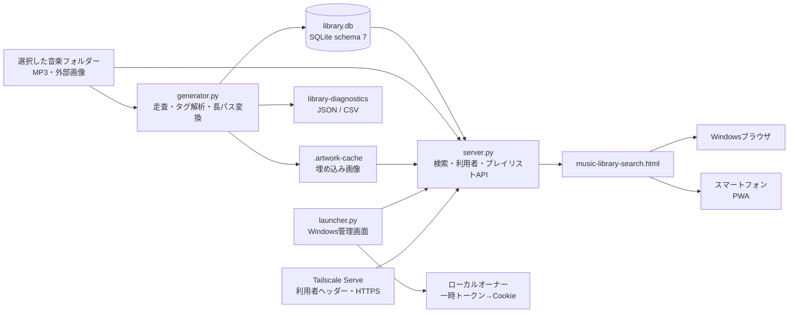

# 自宅音楽ライブラリ v2.7.5

<!-- README_APP_INTRO_START -->
<p align="center">
  
</p>
<p align="center">
  <strong>数千曲のMP3を、PCでもスマートフォンでも。</strong><br>
  検索・再生・お気に入り・プレイリスト・Tailscale経由の外出先利用
</p>
<!-- README_APP_INTRO_END -->

手元のMP3ファイルを音源の正本として、タグ・アートワーク・検索用メタデータ・利用者別状態・プレイリストをSQLiteで管理し、Windows PC、スマートフォン、タブレットのブラウザから検索・再生する個人／家庭向け音楽ライブラリです。

> 製品バージョン: `2.7.5`
> DBスキーマ: `7`
> 対応OS: Windows 10／11 64bit
> 最新公開版: `v2.7.5`（2026-08-03公開）
> ドキュメント監査日: 2026-08-03

## 現行版の要点

- MP3をコピー・再エンコードせず、選択した音楽フォルダーを直接利用
- 曲名、アーティスト、アルバム、作曲者の検索と索引表示
- ライブラリホーム、最近再生、お気に入り、よく聴く曲
- 利用者別の再生回数、最終再生日時、お気に入り、スキン
- 利用者別プレイリストの作成、名称変更、削除、曲順変更、全曲再生
- 6種類のスキン
- Windowsの長いファイルパスに対応
- SQLiteバックアップ・復元
- GitHub Releasesを利用した新版通知
- Tailscale Serve経由の外部利用
- スマートフォンのホーム画面追加（PWA・オンライン利用）
- WindowsインストーラーとGUI管理画面

## v2.7.0からv2.7.5までの追加内容

| バージョン | 主な内容 |
|---|---|
| v2.7.0 | 利用者識別、利用者別再生状態・お気に入り、オーナー関連付け |
| v2.7.1 | ライブラリホーム、バックアップ・復元、新版通知 |
| v2.7.2 | 利用者別スキン |
| v2.7.3 | スマートフォンのホーム画面追加、PWA、モバイル調整 |
| v2.7.4 | Windows長パス対応、起動時オーナー認証の安定化 |
| v2.7.5 | 利用者別プレイリスト、DBスキーマ7、スマートフォン表示改善 |

## 実機確認済みの構成

開発・受入環境では、次の状態でv2.7.5を確認しました。これは製品の固定上限ではなく、確認に使用したライブラリの実績値です。

- MP3: 8,480曲
- アートワークあり: 7,708曲
- 260文字以上の長いパス: 201曲
- 最長絶対パス: 364文字
- 長いパスのスキャンエラー: 0件
- iPhoneのホーム画面からPWA起動
- 実運用DBでプレイリスト1件・3曲を作成し、RC2上書き後も維持
- v2.7.5 RC2の全ソース回帰試験、EXEスモーク試験、Inno Setupコンパイルに合格

## システム全体像


```mermaid
flowchart LR
    MP3["選択した音楽フォルダー<br>MP3・外部画像"] --> SCAN["generator.py<br>走査・タグ解析・長パス変換"]
    SCAN --> DB[("library.db<br>SQLite schema 7")]
    SCAN --> ART[".artwork-cache<br>埋め込み画像"]
    SCAN --> DIAG["library-diagnostics<br>JSON / CSV"]
    DB --> SERVER["server.py<br>検索・利用者・プレイリストAPI"]
    MP3 --> SERVER
    ART --> SERVER
    SERVER --> UI["music-library-search.html"]
    LAUNCHER["launcher.py<br>Windows管理画面"] --> SERVER
    LAUNCHER --> OWNER["ローカルオーナー<br>一時トークン→Cookie"]
    TS["Tailscale Serve<br>利用者ヘッダー・HTTPS"] --> SERVER
    UI --> PC["Windowsブラウザ"]
    UI --> PHONE["スマートフォン<br>PWA"]
```

## 正本の定義

| 対象 | 正本 |
|---|---|
| 音声データ・曲の存在 | 選択した音楽フォルダー内のMP3 |
| 曲・アーティスト・アルバム情報 | `library.db` |
| 利用者・識別情報 | `users`／`user_identities` |
| 再生回数・最終再生・お気に入り | `user_track_state` |
| 利用者別スキン | `user_preferences` |
| プレイリスト・曲順 | `playlists`／`playlist_tracks` |
| 埋め込みアートワークの展開物 | `.artwork-cache` |
| 設定・実行状態 | `%LOCALAPPDATA%\MusicLibrary`配下の設定ファイル |

プレイリストから曲を外したりプレイリストを削除しても、MP3ファイルは削除しません。

## インストールと更新

PC操作に慣れていないオーナーは、ダウンロード、初回設定、Tailscale導入、家族招待までを図解した[オーナー導入・家族共有ガイド](docs/19-owner-setup-guide.md)を上から順に進めてください。

1. GitHub Releasesから`MusicLibrary-Setup-2.7.5-x64.exe`を取得します。
2. 起動中の自宅音楽ライブラリを終了します。
3. 旧版をアンインストールせず、インストーラーを上書き実行します。
4. スタートメニューから「自宅音楽ライブラリ」を起動します。
5. 初回利用時はMP3が保存されているフォルダーを選択します。

利用者データはインストール先とは別の場所へ保存されます。

```text
%LOCALAPPDATA%\MusicLibrary
```

v2.7.4以前のスキーマ6から更新する際は、スキーマ7への移行前に次のバックアップを自動作成します。

```text
%LOCALAPPDATA%\MusicLibrary\Backups\library-pre-v2.7.5-*.db
```

詳しい操作は[利用マニュアル](docs/06-user-manual.md)を参照してください。

## 利用者の識別

一般的なID・パスワード画面は持ちません。接続経路に応じて利用者を識別します。

| 接続 | 識別方法 | 個人状態 |
|---|---|---|
| 管理画面から開いた自宅PC | 短時間の一時トークンをローカルオーナーCookieへ交換 | オーナーへ保存 |
| Tailscale Serve | Tailscaleがlocalhostバックエンドへ付与する利用者情報 | 各利用者へ保存 |
| 識別できない接続 | 匿名 | 検索・再生のみ。個人状態は保存しない |

ローカルオーナーと本人のTailscaleプロフィールは、確認コードとローカル側の明示承認で関連付けます。

## スマートフォン利用

TailscaleのHTTPS URLをSafariまたは対応ブラウザで開き、ホーム画面へ追加できます。専用アイコン、standalone表示、safe area、モバイル向け操作サイズに対応します。

- iPhone／iPad: [App StoreからTailscaleをインストール](https://apps.apple.com/us/app/tailscale/id1470499037?ls=1)
- Android: [Google PlayからTailscaleをインストール](https://play.google.com/store/apps/details?id=com.tailscale.ipn)

PWAは画面表示用のシェルだけをキャッシュします。MP3、API、DB、バックアップ、アートワーク、認証情報をオフライン保存しません。自宅PCとネットワークへ接続できる状態が必要です。

## 長いファイルパス

Windows内部で必要な場合だけ`\\?\`形式へ変換し、MP3の走査、タグ・音声情報・アートワーク取得、内容署名、HTTP Range配信に使用します。DBとブラウザには従来どおり通常の相対パスを保存・返却します。

MP3のファイル名、フォルダー名、タグは変更しません。

## セキュリティ上の境界

- アプリ本体は原則`127.0.0.1`へバインド
- 外部利用はTailscale Serveで中継
- ルーターのポート開放、DMZ、Tailscale Funnelは使用しない
- Tailscale利用者ヘッダーは信頼できるローカル中継からの接続時だけ採用
- ローカルオーナーCookieは`HttpOnly`、`SameSite=Strict`
- DB、設定、ソースコード等を静的配信しない
- API、HTML、JSONは`no-store`
- プレイリストAPIは現在の利用者が所有するデータだけを返す

詳細は[運用・セキュリティ](docs/07-operations-security.md)を参照してください。

## ビルド

`windows-installer`を短いパスへ配置し、`00_build_installer.bat`を実行します。

```text
C:\ML275Build
```

成果物は`windows-installer\release`へ作成されます。正式手順は[Windowsインストーラー文書](windows-installer/docs/README_BUILD.txt)を参照してください。

## ドキュメント

- [文書一覧](docs/00-document-index.md)
- [アプリ仕様](docs/02-application-specification.md)
- [APIリファレンス](docs/04-api-reference.md)
- [DB設計](docs/05-database-design.md)
- [利用マニュアル](docs/06-user-manual.md)
- [オーナー導入・家族共有ガイド](docs/19-owner-setup-guide.md)
- [トラブルシューティング](docs/08-troubleshooting.md)
- [変更履歴](docs/10-changelog.md)
- [文書監査結果](docs/18-documentation-audit-v2.7.5.md)

Windows配布物に同梱する文書は[インストーラー文書一覧](windows-installer/docs/DOCUMENT_INDEX_v2.7.5.md)を参照してください。

## ライセンスと注意

個人／家庭内利用を主目的とするセルフホスト型アプリです。MP3や画像の権利、家庭外への配信範囲、利用するネットワークの安全性は利用者が管理してください。第三者ライブラリの情報は[THIRD_PARTY_NOTICES](docs/THIRD_PARTY_NOTICES.md)に記載しています。
