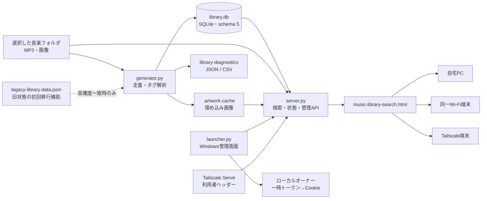

# MP3 Source Music Library v2.7.0

手元のMP3ファイルを音源の正本として、タグ・アートワーク・検索用メタデータ・利用者別の再生状態をSQLiteで管理し、Windows PC・スマートフォン・タブレットのブラウザから検索・再生する個人／家庭向け音楽ライブラリです。

> 製品バージョン: `2.7.0`<br>
> DBスキーマ: `5`<br>
> 対応OS: Windows 10／11 64bit<br>
> ドキュメント更新日: 2026-08-01

## v2.7.0の主な内容

v2.7.0では、従来はライブラリ全体で共有していた再生回数・最終再生日時・お気に入りを、利用者ごとの状態として保存できるようになりました。

- 自宅PCの管理画面から開いたブラウザをローカルオーナーとして識別
- Tailscale Serveが付与するログイン情報で外部利用者を識別
- 現在の利用者を画面右上へ表示
- 利用者ごとの再生回数・最終再生日時
- 利用者ごとのお気に入り
- 「★ お気に入りのみ」による絞り込み
- ローカルオーナーと本人のTailscaleプロフィールを確認付きで関連付け
- 関連付け時に双方の個人状態を安全に統合
- オーナー向け利用者一覧と、非オーナー利用者の利用停止・再開
- v2.6.3以前の共通状態をオーナーへ移行するDBスキーマ5

## プロジェクトの起点

このプロジェクトは、iTunesからエクスポートしたXMLに含まれる8,383曲を、費用をかけずに検索する完全静的Webアプリとして始まりました。

その後、外部JSON化、MP3再生、アートワーク、MP3正本化、SQLite API、Windowsインストーラー、LAN利用、Tailscale利用、利用者別状態へ段階的に発展しています。詳細は[プロジェクトの起点と初期要件](docs/00-project-origin-and-requirements.md)を参照してください。

## 主な特徴

- `Music`フォルダ内の物理MP3ファイル1つを1曲として登録
- ID3タグ、ファイル名、フォルダ名からメタデータを生成
- UTF-8／UTF-16／CP932／Latin-1由来の文字化けを補正
- SQLiteによる検索・集計・80件単位のページ取得
- 曲名、アーティスト、アルバム、作曲者の検索
- 曲・アーティスト・アルバムの3ビューとドリルダウン
- アルファベット索引、五十音索引、漢字・その他分類
- 曲名・アーティスト名の手動表記補正
- アートワーク表示と最大化プレーヤー
- シャッフル、全体リピート、1曲リピート
- MP3のByte Range配信とシーク
- MP3の移動・改名検出
- 利用者別の再生回数・最終再生日時・お気に入り
- 同一Wi-FiおよびTailscale経由で利用可能
- MP3を再エンコードせず配信するため、サーバー処理による音質変換なし
- WindowsインストーラーとGUI管理画面

## システム全体像


```mermaid
flowchart LR
    MP3["選択した音楽フォルダ<br>MP3・画像"] --> SCAN["generator.py<br>走査・タグ解析"]
    LEGACY["legacy-library-data.json<br>旧状態の初回移行補助"] -. 高確度一致時のみ .-> SCAN
    SCAN --> DB[("library.db<br>SQLite・schema 5")]
    SCAN --> ART[".artwork-cache<br>埋め込み画像"]
    SCAN --> DIAG["library-diagnostics<br>JSON / CSV"]
    DB --> SERVER["server.py<br>検索・状態・管理API"]
    MP3 --> SERVER
    ART --> SERVER
    SERVER --> UI["music-library-search.html"]
    LAUNCHER["launcher.py<br>Windows管理画面"] --> SERVER
    LAUNCHER --> LOCAL["ローカルオーナー<br>一時トークン→Cookie"]
    TS["Tailscale Serve<br>利用者ヘッダー"] --> SERVER
    UI --> PC["自宅PC"]
    UI --> LAN["同一Wi-Fi端末"]
    UI --> REMOTE["Tailscale端末"]
```

## 正本の定義

| 対象 | 正本 |
|---|---|
| 音声データ・曲の存在 | 利用者が選択した音楽フォルダ内のMP3 |
| 曲・アーティスト・アルバム情報 | `library.db` |
| 利用者別の再生回数・最終再生日時・お気に入り・評価 | `library.db` の `user_track_state` |
| 曲名・アーティスト名の表記補正 | `library.db` |
| 利用者・Tailscale識別情報 | `library.db` の `users`／`user_identities` |
| 埋め込みアートワークの展開物 | `.artwork-cache` |
| 旧システムの再生回数・追加日 | `legacy-library-data.json`（初回登録時の補助のみ） |

## インストールと起動

1. GitHub Releasesから`MusicLibrary-Setup-2.7.0-x64.exe`を取得します。
2. 旧版がインストール済みでも、通常はアンインストールせず上書きします。
3. スタートメニューの「自宅音楽ライブラリ」を開きます。
4. MP3が保存されているフォルダを選択します。
5. 「ライブラリを開始」を押します。
6. 自動で開いたブラウザから検索・再生します。

利用者データはインストール先とは別の次の場所へ保存されます。

```text
%LOCALAPPDATA%\MusicLibrary
```

詳細は[利用マニュアル](docs/06-user-manual.md)を参照してください。

## 利用者の識別

このアプリは一般的なID・パスワード方式のログイン画面を持ちません。代わりに、接続経路に応じて次の方法で利用者を識別します。

| 接続 | 識別方法 | 個人状態の保存 |
|---|---|---|
| 管理画面から開いた自宅PC | 管理画面が発行する短時間の一時トークンをCookieへ交換 | オーナーへ保存 |
| Tailscale Serve | Tailscaleがlocalhostバックエンドへ付与する利用者ヘッダー | Tailscale利用者へ保存 |
| 識別できない接続 | 匿名 | 検索・再生は可能、個人状態は保存しない |

ローカルオーナーと本人のTailscaleアカウントは、画面上で一時コードを発行し、本人確認後に関連付けます。自動で家族をオーナーへ昇格させることはありません。

## セキュリティ上の位置づけ

- サーバー本体は`127.0.0.1`へバインドし、Tailscale Serveが外部接続を中継
- ルーターのポート開放、DMZ、Tailscale Funnelは使用しない
- Tailscale利用者ヘッダーは、localhostへ接続するTailscale Serveから渡された場合だけ信頼
- ローカルオーナー用Cookieは`HttpOnly`、`SameSite=Strict`、有効期限12時間
- オーナー関連付けコードは短時間だけ有効で、ローカルオーナーの明示承認が必要
- オーナーは利用停止にできない
- 利用者の停止・再開はローカルオーナーだけが実行可能
- MP3、DB、診断ファイル、個人のTailscale情報をGitHubへ含めない

詳細は[運用・セキュリティ設計](docs/07-operations-security.md)を参照してください。

## ドキュメント

| 文書 | 内容 |
|---|---|
| [文書一覧](docs/00-document-index.md) | 読む順番、対象読者、v2.7.0更新範囲 |
| [プロジェクトの起点と初期要件](docs/00-project-origin-and-requirements.md) | iTunes XML版からの開発起点 |
| [アーキテクチャ構成](docs/01-architecture.md) | 配置、起動、走査、利用者識別、状態保存 |
| [アプリ仕様書](docs/02-application-specification.md) | 機能・非機能・制約 |
| [アプリ詳細設計書](docs/03-detailed-design.md) | モジュールと処理詳細 |
| [APIリファレンス](docs/04-api-reference.md) | HTTP API、権限、入出力 |
| [データベース設計書](docs/05-database-design.md) | schema 5、テーブル、移行・統合 |
| [利用マニュアル](docs/06-user-manual.md) | インストール、利用者、Tailscale、更新 |
| [運用・セキュリティ設計](docs/07-operations-security.md) | バックアップ、権限、公開範囲 |
| [トラブルシューティング](docs/08-troubleshooting.md) | 起動・外部接続・長いパス等 |
| [テスト計画書](docs/09-test-plan.md) | 自動テスト・実機受入試験 |
| [変更履歴](docs/10-changelog.md) | 初期版からv2.7.0まで |
| [GitHub公開ガイド](docs/11-github-publishing-guide.md) | 公開対象、除外、Release運用 |
| [note投稿原稿](docs/12-note-article.md) | v2.7.0追補記事案 |
| [ロードマップ](docs/13-roadmap.md) | 完了項目と今後の候補 |
| [用語集](docs/14-glossary.md) | schema 5・利用者識別を含む用語 |
| [実装確認メモ](docs/15-source-verification.md) | 文書とソース／テストの対応 |
| [要件トレーサビリティ](docs/16-requirements-traceability.md) | 要件と実装・試験の対応 |
| [UI／UX設計の変遷](docs/17-ui-ux-design-history.md) | カード目録から利用者UIまで |
| [第三者ライセンス](docs/THIRD_PARTY_NOTICES.md) | 同梱ライブラリの通知 |

## GitHubへ公開しないもの

- MP3／音源ファイル
- `library.db`、`library.db-wal`、`library.db-shm`
- `.artwork-cache`
- `Backups`、`Exports`、`Logs`
- `config.json`、`remote-url.txt`
- `legacy-library-data.json`
- `library-diagnostics.json`、`library-diagnostics.csv`
- 実際のTailscaleログイン名、表示名、プロフィール画像URL
- IPアドレス、メールアドレス、関連付けコード、Cookieが写った画像

## 対応範囲と制限

### 実装済み

- Windows上のMP3ライブラリとGUI管理画面
- SQLite API検索・ドリルダウン
- PC／スマホ／タブレットのブラウザ再生
- 同一Wi-Fi・Tailscale Serve経由の利用
- Tailscale単位の利用者識別
- 利用者別の再生回数・最終再生日時・お気に入り
- ローカルオーナーと本人Tailscaleプロフィールの関連付け・状態統合
- オーナー向け利用者管理

### 未実装・対象外

- アプリ独自のパスワード認証、パスワード再発行
- プレイリスト
- 評価を操作するUI（DB項目と統合ロジックは存在）
- FLAC／AAC等のライブラリ走査
- PWAオフライン再生
- サーバー側トランスコード
- 公開インターネット向け運用
- Windowsサービスとしての常駐

## 既知の注意点

Windowsの長いパスが無効な環境では、フルパスが約260文字以上になるMP3が`FileNotFoundError`として診断される場合があります。音楽フォルダを浅い場所へ移す、フォルダ名を短くする、またはWindowsの長いパス設定を確認してください。

## ライセンス

プロジェクト本体のライセンスはリポジトリのライセンスファイルを確認してください。同梱する第三者コードの通知は[THIRD_PARTY_NOTICES.md](docs/THIRD_PARTY_NOTICES.md)および`windows-installer/src/vendor/MUTAGEN_LICENSE.txt`を参照してください。

<!-- BEGIN WINDOWS-INSTALLER-V2.7.2 -->

## Windowsインストーラー版

Windows 10・11（64bit）では、Pythonやコマンド操作なしで使えるWindowsインストーラー版を配布しています。

### 最新版 v2.7.2

v2.7.2では、機能や画面配置を変えずに、利用者ごとに見た目を着せ替えられるスキン機能を追加しました。

- ライブラリー：これまでの紙とカード目録を基調とした標準デザイン
- ミッドナイト：落ち着いた濃紺のダークデザイン
- ネオン：黒地にシアンとマゼンタの発光
- サイバーパンク：黄色とマゼンタの端末風デザイン
- キャンディー：ビビッドでカラフルな明るいデザイン
- モノクローム：白・黒・グレーを基調とし、アートワークも画面上で白黒表示
- カード選択による適用前プレビューとキャンセル
- 利用者ごとのスキン保存
- ローカルオーナーと関連付け済みTailscaleオーナー間の設定共有
- スキーマv6への安全な自動移行と移行前バックアップ

モノクロームの白黒化は画面表示だけに適用します。元のアートワーク画像は変更せず、別のスキンへ戻すとカラー表示へ戻ります。

### ダウンロードと更新

1. [v2.7.2 Release](https://github.com/k-systems202208/mp3-source-music-library/releases/tag/v2.7.2)を開く
2. `MusicLibrary-Setup-2.7.2-x64.exe`をダウンロード
3. 自宅音楽ライブラリを終了
4. インストーラーを実行
5. 「自宅音楽ライブラリ」を起動

v2.7.1をアンインストールせず、そのまま上書き更新できます。既存のMP3参照先、収録曲、利用者、再生回数、お気に入り、設定、バックアップは維持されます。

### 主な機能

- MP3・ID3タグ・アートワークの読込み
- ライブラリホーム
- 曲・アーティスト・アルバム検索
- ブラウザ再生、シーク、シャッフル、リピート
- 利用者別の再生回数・最終再生日時・お気に入り
- 利用者別スキン
- バックアップ・復元画面
- GitHub Releaseを利用した新版通知
- Tailscale Serveによる外部接続
- ローカルオーナーと本人Tailscaleプロフィールの関連付け
- スタートメニュー登録とアンインストール

### 外出先から利用する

管理画面の「外部接続をかんたん設定」を使用します。

```text
https://PC名.tailnet名.ts.net/music-library-search.html
```

ルーターのポート開放やTailscale Funnelは使用しません。

### データ保存場所

```text
アプリ本体：
%LOCALAPPDATA%\Programs\MusicLibrary

管理データ：
%LOCALAPPDATA%\MusicLibrary

MP3：
利用者が選択した既存フォルダ
```

### 注意

- MP3音源、`library.db`、Tailscale認証情報は配布物に含まれません
- Setup.exeは未署名のため、SmartScreenの警告が出る場合があります
- 自宅PCが停止またはスリープ中は外部利用できません
- 新版通知は自動ダウンロードや自動インストールを行いません
- 公開インターネット向けのポート開放運用は対象外です

### 開発者向け

```text
windows-installer\00_build_installer.bat
```

をWindows上で実行すると、Pythonを同梱した64bit版インストーラーを生成します。

<!-- END WINDOWS-INSTALLER-V2.7.2 -->
