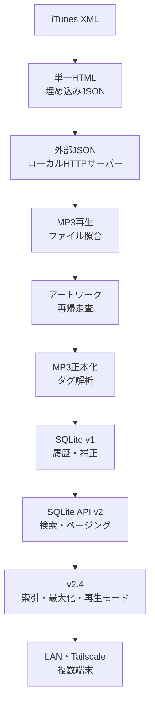

# プロジェクトの起点と初期要件

## 1. この文書の位置づけ

本書は、現行の「MP3正本・SQLite API v2.4」へ至る前段階を記録したものです。

プロジェクトは最初からMP3再生サーバーとして始まったわけではありません。起点は、**iTunesからエクスポートしたXMLライブラリを検索するWebアプリ**でした。

その後、検索UIの改善、表記補正、外部JSON化、MP3再生、アートワーク、MP3正本化、SQLite、LAN・Tailscale利用へ段階的に発展しました。

---

## 2. 最初の要求

初期要求は次のとおりでした。

```text
iTunesのライブラリをエクスポートしたXMLデータを検索したい
WebサーバーやDBを含め、可能な限り無料で実現したい
```

対象となったライブラリは8,383曲でした。

### 初期の優先順位

1. 月額費用をかけない
2. 導入を簡単にする
3. 8,000曲超を検索できる
4. 特別なサーバー管理を不要にする
5. ブラウザだけで閲覧できる
6. 後からUIを改善しやすくする

---

## 3. 初期アーキテクチャ

最初は、iTunes XMLをJSONへ変換し、そのJSONをHTMLへ埋め込む完全静的構成でした。


### コストゼロとした理由

- Webサーバー不要
- DB不要
- ローカルではHTMLをダブルクリックするだけ
- ネット接続不要
- 公開する場合も静的ホスティングへ配置可能
- 保守するサーバープロセスがない

この時点では「検索アプリ」であり、音源再生は対象外でした。

---

## 4. 初期実装の機能

- 曲名・アーティスト・アルバム・作曲者のリアルタイム検索
- ジャンル絞り込み
- 曲名・アーティスト・アルバム・年・追加日・再生回数・長さで並べ替え
- 件数と合計再生時間の表示
- スクロールによる追加読み込み
- 8,000曲超のブラウザ内処理

### デザインコンセプト

UIは図書館の**カード目録・索引カード**をモチーフにしました。

音楽の「ライブラリ」を検索する体験と、図書館で資料を探す体験を重ねたものです。このデザイン言語は、現行版のカード表示にも引き継がれています。

---

## 5. 初期UIの改善履歴

### 5.1 曲カードの簡素化

初期カードにあった左側の先頭文字表示を削除し、情報の優先順位を次へ統一しました。

```text
曲名
アルバム
アーティスト
```

年やジャンル等を常時並べず、主要情報を素早く読めることを優先しました。

### 5.2 アルバム・アーティストをリンク化

曲カード上のアルバム名・アーティスト名をクリック可能にし、同じ対象の曲へ絞り込めるようにしました。

当初は、次のフィルターチップを上部へ表示していました。

```text
アーティスト: ○○ ×
アルバム: ○○ ×
```

検索欄と併用し、特定アーティストやアルバムの中をさらに検索できる仕様でした。

---

## 6. ローマ字曲名への対応方針

iTunes XMLには、本来日本語の曲名がローマ字表記になっているものがありました。

しかし、日本人アーティストの英語曲名も多数存在します。

例:

```text
Body Feels EXIT
```

そのため、ローマ字曲名を機械的に日本語へ一括変換すると、存在しない曲名を生成する危険があります。

### 採用した方針

自動変換ではなく、利用者が正式表記を確認して補正する方式としました。

- 曲名横の編集ボタン
- Google検索で正式表記を確認するボタン
- 英数字タイトルのみの絞り込み
- 訂正済みのみの絞り込み
- 訂正済みラベル
- ブラウザlocalStorageへの保存

この判断は現行版にも引き継がれています。

現行版では保存先をlocalStorageからSQLiteへ変更し、複数端末で補正結果を共有します。

---

## 7. アーティスト名補正

次に、アーティスト名も編集可能にしました。

初期版では、同じ元アーティスト名を持つ曲すべてへ一括反映し、localStorageへ保存していました。

例:

```text
Ｍｒ．Children
↓
Mr.Children
```

現行版では、SQLiteの`artists`マスターへ補正値を保存します。

これにより、同じartist_idを持つ全曲へ反映され、PC・スマホ・タブレットでも共通表示になります。

---

## 8. 3種類の一覧とドリルダウン

プルダウンを廃止し、画面上部を次の3ボタンへ変更しました。

```text
曲名
アーティスト
アルバム
```

### 曲名

全曲のフラットな一覧と検索です。

### アーティスト

```text
アーティスト一覧
  ↓
選択アーティストのアルバム一覧
  ↓
選択アルバムの曲一覧
```

### アルバム

```text
全アルバム一覧
  ↓
選択アルバムの曲一覧
```

現在地を示すパンくずリストも追加しました。

```text
アーティスト一覧
› Mr.Children
› SUPERMARKET FANTASY
```

この画面構造は現行版にもそのまま受け継がれています。

---

## 9. 外部JSON化

単一HTMLへ8,383曲分のJSONを埋め込む方式は、配布は簡単ですが、HTMLが約2.7MBまで肥大化しました。

そこで、次の構成へ変更しました。

```text
music-library-search.html
music-library-data.json
start-music-library.bat
```

ブラウザは`fetch()`でJSONを読み込み、ローカルHTTPサーバーをBATから起動する方式です。

この変更が、後のMP3配信サーバー・SQLite API化の土台になりました。

---

## 10. 現行版までのアーキテクチャ変遷



---

## 11. 初期要件から変わった点

| 項目 | 初期 | 現行v2.4 |
|---|---|---|
| 曲情報の正本 | iTunes XML由来JSON | MP3タグ＋SQLite |
| 音源再生 | なし | MP3を無変換配信 |
| 保存 | HTML／localStorage | SQLite |
| 検索処理 | ブラウザ内 | SQLite API |
| 全件読込 | あり | 80件ページング |
| サーバー | 不要 | ローカルPython |
| DB | 不要 | SQLite |
| 月額サーバー費用 | なし | なし |
| スマホ | 静的閲覧想定 | LAN・Tailscale再生 |
| 補正共有 | 端末内のみ | 全端末共通 |
| 旧XML情報 | 主データ | 初回移行補助 |

「サーバーやDBを使わない」という初期構成は、当時の要求に対して最適でした。

その後、実音源再生・再生回数・複数端末共有という要求が追加されたため、**外部の有料サーバーを使わず、自宅PC内のPythonとSQLiteを使う構成**へ発展しました。

---

## 12. 現在も維持している設計思想

- 可能な限り追加費用をかけない
- データを外部クラウドへ預けない
- 誤った自動補正より、確認可能な手動補正を優先する
- 大量データでも必要な件数だけ表示する
- UIは検索とドリルダウンを中心にする
- 元データを破壊せず補正値を別管理する
- 機能追加に応じて正本を明確にする
