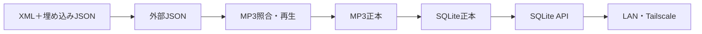
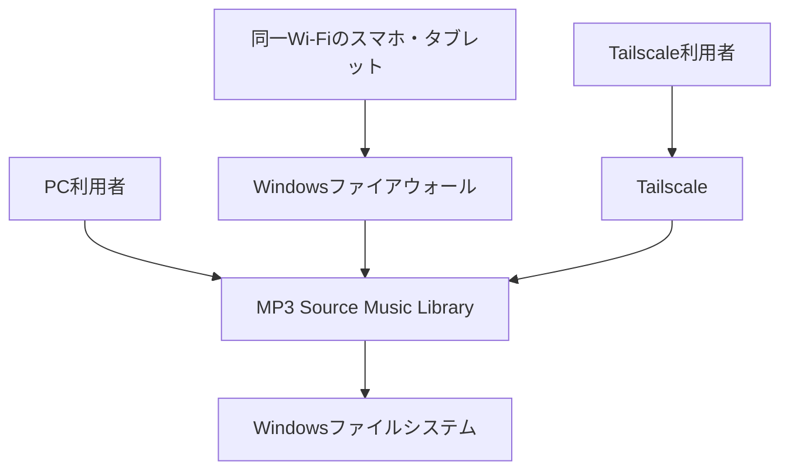
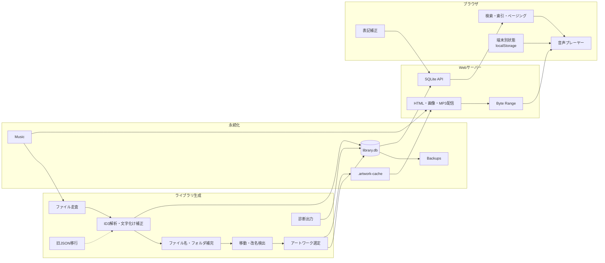
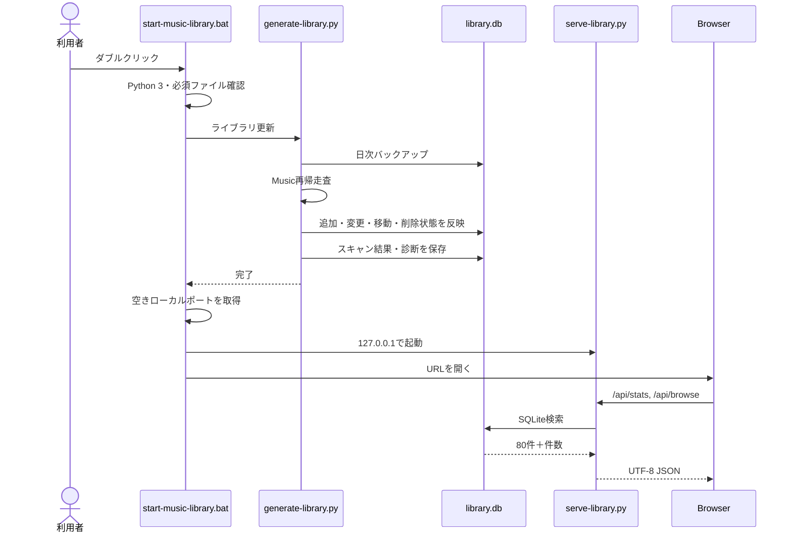
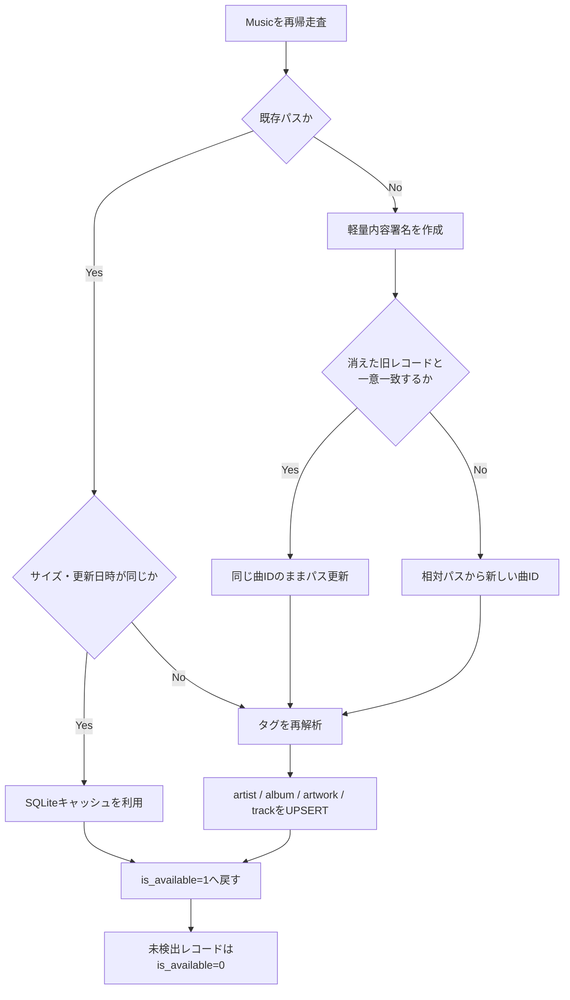
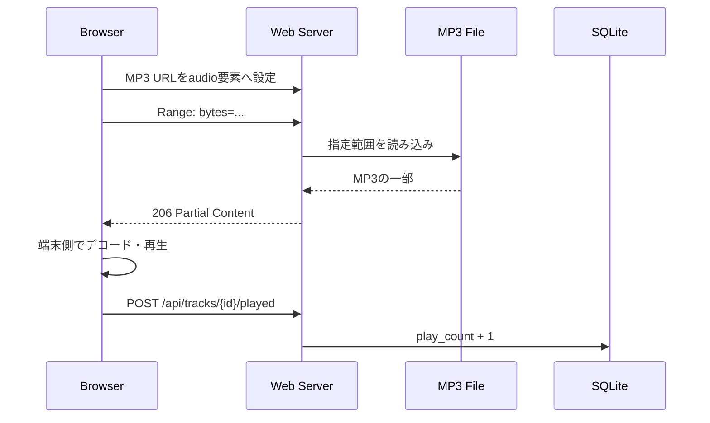

# アーキテクチャ構成

## 1. 目的

本システムは、大量のMP3ファイルをブラウザから高速に検索・再生し、再生回数や表記補正を永続管理する個人向け音楽ライブラリです。

設計上の中心は次の2点です。

1. **音声の正本をMP3ファイルとする**
2. **管理情報の正本をSQLiteとする**

旧方式の「別JSONにある曲情報とMP3を照合する」構成を廃止し、物理MP3ファイル1つを1曲として扱います。


## 1.1 アーキテクチャの起点

本システムの前身は、iTunesからエクスポートしたXMLをJSONへ変換し、8,383曲分を単一HTMLへ埋め込む完全静的アプリでした。


この方式は、費用・導入・保守の面で優れていました。一方、MP3再生、再生回数の更新、複数端末共有を追加すると、ブラウザだけでは永続データや音源配信を扱いにくくなりました。

そのため次の段階を経て現在の構成へ移行しています。



「可能な限り無料」という方針は維持し、外部の有料サーバーではなく、既存のWindows PC・Python標準機能・SQLiteを使用します。

## 2. 設計原則

- MP3が存在することを曲の存在条件とする
- SQLiteはMP3を置き換えず、検索・補正・履歴を担当する
- ブラウザへ全曲を一括送信しない
- 音声は再エンコードせず元のMP3をByte Range配信する
- 表示名補正はMP3タグを書き換えず、SQLiteへ保存する
- MP3が一時的に読めなくても、前回成功時のメタデータを可能な限り保持する
- ローカル利用を既定とし、外部利用はネットワーク層で保護する

## 3. システムコンテキスト



## 4. 論理コンポーネント



## 5. 物理配置

```text
mp3_source_player_sqlite/
├─ Music/                       MP3・外部アートワーク
├─ .artwork-cache/              埋め込みアートワーク展開先
├─ Backups/                     SQLiteバックアップ
├─ Exports/                     手動JSONエクスポート
├─ vendor/mutagen/              ID3解析ライブラリ
├─ library.db                   管理情報の正本
├─ generate-library.py          スキャン・DB同期
├─ database.py                  DBスキーマ・検索・更新
├─ serve-library.py             API・静的ファイル・MP3配信
├─ music-library-search.html    画面
├─ library-maintenance.py       保守コマンド
├─ start-music-library.bat      ローカル起動
├─ backup-library.bat           手動バックアップ
└─ export-library-json.bat      JSONエクスポート
```

## 6. 起動シーケンス



## 7. スキャン・同期シーケンス



## 8. 検索アーキテクチャ

旧方式では全曲JSONをブラウザへ読み込み、JavaScriptが検索していました。v2以降は検索条件をAPIへ送り、SQLiteが検索・集計・並べ替えを行います。

```text
ブラウザ
  └─ GET /api/browse?...&limit=80&offset=0
       ↓
serve-library.py
       ↓
database.py
  ├─ WHERE条件
  ├─ 頭文字集計
  ├─ 合計曲数・時間集計
  ├─ ORDER BY
  └─ LIMIT / OFFSET
       ↓
80件だけブラウザへ返却
```

1ページは80件、API上限は200件です。

## 9. 再生アーキテクチャ



MP3はトランスコードしません。Wi-FiやVPNが遅い場合はバッファリングが起きますが、サーバーが自動的に低音質へ変換することはありません。

## 10. 配置方式

### 10.1 PC内限定

```text
Browser → http://127.0.0.1:動的ポート
```

### 10.2 同一Wi-Fi

```text
Smartphone → http://PCのLAN IP:8765
             ↓
       Windows Firewall
             ↓
      0.0.0.0:8765
```

### 10.3 外出先

```text
Smartphone
   ↓ Tailscale暗号化ネットワーク
Tailscale Serve（HTTPS）
   ↓
127.0.0.1:8765
   ↓
Music Library
```

## 11. データ所有境界

| データ | 共有単位 |
|---|---|
| 再生中の曲・再生位置 | ブラウザごと |
| 音量 | ブラウザ／OSごと |
| シャッフル・リピート設定 | ブラウザのlocalStorageごと |
| 検索条件・表示状態 | ブラウザごと |
| 再生回数 | 全利用者共通のSQLite |
| 曲名・アーティスト補正 | 全利用者共通のSQLite |
| MP3・アートワーク | サーバーPC共通 |

## 12. 同時利用

`ThreadingHTTPServer`がリクエストごとに処理し、複数端末へ別のMP3を同時配信できます。SQLiteはWALモードを利用し、検索中の短い書き込みを許容します。

- 各端末は別の曲を独立再生可能
- 同じ曲の同時再生も可能
- 再生回数は全端末分を合算
- 表記補正が競合した場合は最後に保存した値が残る
- ユーザー別履歴は未実装

## 13. セキュリティ境界

### 実装内

- `.db`、`.sqlite`、`.py`、`.bat`の静的取得を拒否
- `Backups`、`Exports`の取得を拒否
- API／HTML／JSONへ`Cache-Control: no-store`
- `X-Content-Type-Options: nosniff`
- `Referrer-Policy: same-origin`
- POST JSON本文は64KiB以下
- SQLパラメーターをバインドして実行

### 実装外

- ユーザー認証
- 権限管理
- TLS終端
- 公開範囲の制限

これらはWindowsファイアウォールとTailscaleで実現します。

## 14. 品質特性

| 特性 | 設計 |
|---|---|
| 性能 | SQLite検索、80件ページング、差分スキャン |
| 可用性 | 読み取り失敗時に既存メタデータを保持 |
| 保守性 | generator / database / server / UIを分離 |
| 移行性 | 旧JSONを初回補助として利用 |
| データ保護 | 日次自動バックアップ、論理削除 |
| 拡張性 | favorite、rating、album_override等の予約列 |
| 音質 | 無変換MP3配信 |
