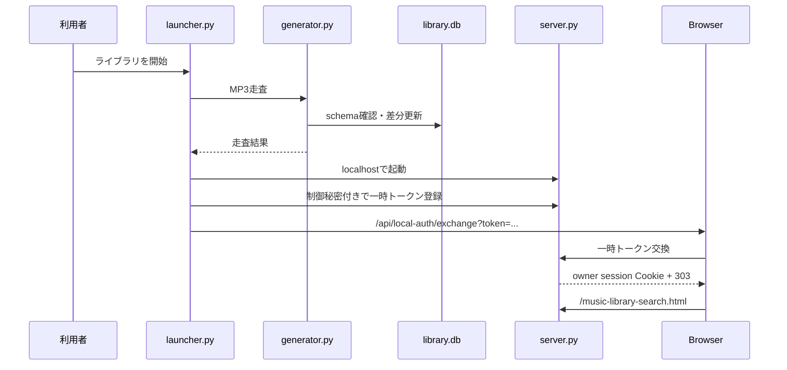
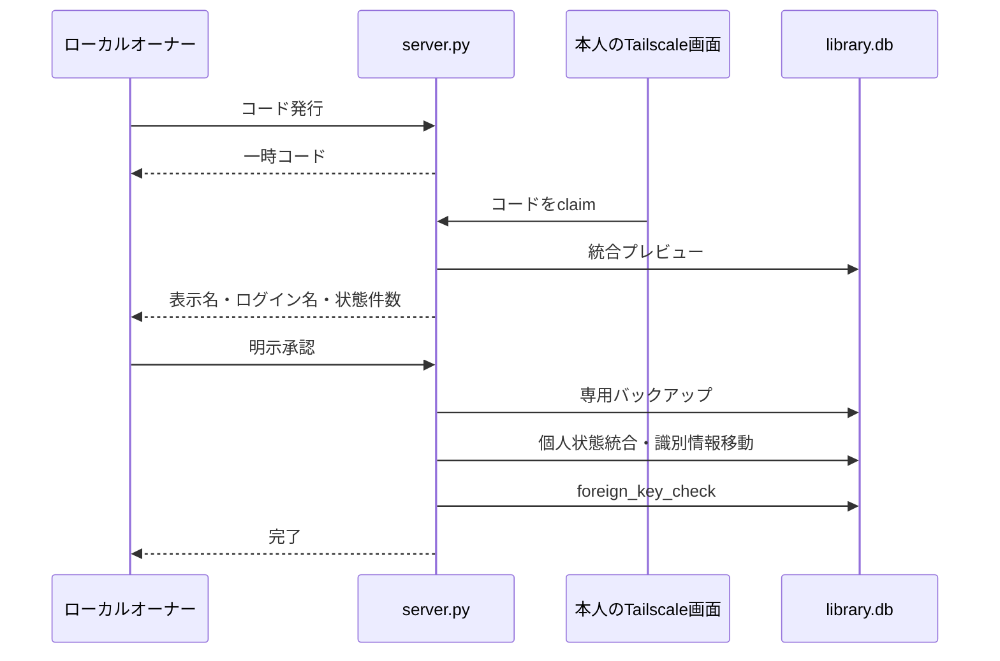

# アーキテクチャ構成

## 1. 配置

```text
Program Files / インストール先
└─ アプリ本体、HTML、同梱ライブラリ

%LOCALAPPDATA%\MusicLibrary
├─ library.db
├─ config.json
├─ remote-url.txt
├─ .artwork-cache\
├─ Backups\
├─ Exports\
├─ Logs\
├─ library-diagnostics.json
└─ library-diagnostics.csv

利用者が選択した音楽フォルダ
└─ MP3・外部アートワーク
```

アプリ本体の更新と利用者データを分離します。上書きインストールしても`%LOCALAPPDATA%\MusicLibrary`と音楽フォルダは維持されます。

## 2. 実行構成

| モジュール | 責務 |
|---|---|
| `launcher.py` | GUI管理画面、フォルダ選択、走査起動、サーバー起動・停止、ブラウザ起動、Tailscale設定 |
| `generator.py` | MP3走査、タグ解析、文字化け補正、アートワーク、差分同期、診断出力 |
| `database.py` | schema 5、検索、状態保存、移行、バックアップ、利用者管理、オーナー統合 |
| `server.py` | HTTP、API、静的ファイル、MP3 Range配信、利用者解決、権限制御 |
| `local_auth.py` | ローカルオーナー用一時トークンとセッションCookie |
| `tailscale_identity.py` | Tailscale Serveヘッダーの検証・正規化 |
| `owner_link.py` | 関連付けコード、候補、期限、状態機械 |
| `remote_access.py` | Tailscale CLI検出、Serve有効化・停止、URL保存 |
| `paths.py` | リソース・データ・音楽・キャッシュのパス境界 |
| `music-library-search.html` | 検索、ドリルダウン、プレーヤー、お気に入り、利用者UI |

## 3. 起動シーケンス


```mermaid
sequenceDiagram
    participant U as 利用者
    participant L as launcher.py
    participant G as generator.py
    participant D as library.db
    participant S as server.py
    participant B as Browser

    U->>L: ライブラリを開始
    L->>G: MP3走査
    G->>D: schema確認・差分更新
    G-->>L: 走査結果
    L->>S: localhostで起動
    L->>S: 制御秘密付きで一時トークン登録
    L->>B: /api/local-auth/exchange?token=...
    B->>S: 一時トークン交換
    S-->>B: owner session Cookie + 303
    B->>S: /music-library-search.html
```

## 4. 利用者解決の優先順位

1. Tailscale Serveの利用者ヘッダーを検証
2. Tailscale利用者が有効なら、その利用者を採用
3. Tailscale利用者がなければ、ローカルオーナーCookieを検証
4. どちらも成立しなければ匿名

Tailscale経由の要求にローカルオーナーCookieが混在しても、Tailscaleの利用者境界を優先します。

## 5. データ走査

- 音楽フォルダ内の`.mp3`を再帰走査
- ファイルサイズ・更新時刻・内容署名を使用して差分判定
- Mutagenとフォールバック解析でタグ・再生時間・埋め込み画像を取得
- 外部画像を同一フォルダから選択
- 同じ内容署名の旧パスが一意に対応する場合だけ移動と判定
- 読み取り不能ファイルを診断JSON／CSVと`scan_errors`へ記録
- 既存レコードを消さず`is_available=0`で不在を表現

## 6. 検索

ブラウザは`/api/browse`へ条件を送り、SQLiteがページ単位で返します。主要ビューは次のとおりです。

- `songs`
- `artists`
- `artist_albums`
- `albums`
- `artist_tracks`
- `album_tracks`

利用者が識別されている場合、レスポンスへその利用者の`favorite`、`playCount`、`lastPlayedAt`等を結合します。

## 7. 再生

MP3は再エンコードせずHTTPで配信します。ブラウザの`Range`要求へ`206 Partial Content`で応答し、シークと途中再生に対応します。

## 8. schema 5移行

初回接続前にDB形式を確認し、v2.7.0より古いDBでは専用バックアップを作成します。schema 5作成、オーナー作成、旧共通状態の`user_track_state`移行、外部キー検査を一つのトランザクション内で実行します。

## 9. オーナー関連付け


```mermaid
sequenceDiagram
    participant LP as ローカルオーナー
    participant S as server.py
    participant TS as 本人のTailscale画面
    participant DB as library.db

    LP->>S: コード発行
    S-->>LP: 一時コード
    TS->>S: コードをclaim
    S->>DB: 統合プレビュー
    S-->>LP: 表示名・ログイン名・状態件数
    LP->>S: 明示承認
    S->>DB: 専用バックアップ
    S->>DB: 個人状態統合・識別情報移動
    S->>DB: foreign_key_check
    S-->>LP: 完了
```

評価競合、識別情報の不整合、候補変更、期限切れがあれば処理を中止します。

## 10. 外部接続

サーバーはlocalhostへバインドしたまま、Tailscale ServeがHTTPSで中継します。

```text
スマートフォン
  ↓ Tailscale認証済みHTTPS
Tailscale Serve
  ↓ 利用者ヘッダーを付与
127.0.0.1:8765
```

Funnelやルーターのポート開放は使用しません。
