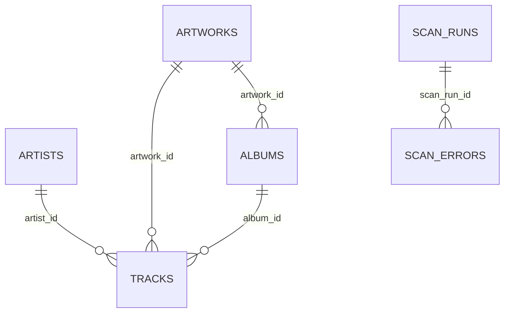

# データベース設計書

## 1. 基本情報

| 項目 | 内容 |
|---|---|
| DBMS | SQLite |
| ファイル | `library.db` |
| スキーマバージョン | 4 |
| Journal | WAL |
| 外部キー | 有効 |
| busy timeout | 30秒 |
| 日時 | タイムゾーン付きISO 8601文字列 |

## 2. ER概要



## 3. schema_info

| 列 | 型 | 制約 | 内容 |
|---|---|---|---|
| key | TEXT | PK | 設定キー |
| value | TEXT | NOT NULL | 値 |

主なキー:

- `schema_version`
- `created_by`
- `catalog_sort_tags_backfilled`
- `track_sort_tags_backfilled`

## 4. artists

| 列 | 型 | 制約 | 内容 |
|---|---|---|---|
| id | TEXT | PK | 安定ID |
| name | TEXT | NOT NULL | 元タグ名 |
| normalized_name | TEXT | NOT NULL, UNIQUE | 検索・同一判定 |
| sort_name | TEXT | NOT NULL | TSOP |
| display_name_override | TEXT | NULL可 | UI補正 |
| created_at | TEXT | NOT NULL | 作成日時 |
| updated_at | TEXT | NOT NULL | 更新日時 |

## 5. artworks

画像本体はDBへ格納しません。

| 列 | 型 | 制約 | 内容 |
|---|---|---|---|
| id | TEXT | PK | 安定ID |
| relative_path | TEXT | NOT NULL, UNIQUE | 相対パス |
| source_type | TEXT | NOT NULL | embedded / external |
| source_mp3_path | TEXT | NOT NULL | 埋め込み元 |
| mime_type | TEXT | NOT NULL | MIME |
| file_hash | TEXT | NOT NULL | SHA-256 |
| created_at | TEXT | NOT NULL | 作成日時 |
| updated_at | TEXT | NOT NULL | 更新日時 |

## 6. albums

| 列 | 型 | 制約 | 内容 |
|---|---|---|---|
| id | TEXT | PK | 安定ID |
| title | TEXT | NOT NULL | アルバム名 |
| normalized_title | TEXT | NOT NULL | 正規化名 |
| album_artist | TEXT | NOT NULL | TPE2または曲アーティスト |
| normalized_album_artist | TEXT | NOT NULL | 同一判定 |
| sort_title | TEXT | NOT NULL | TSOA |
| year | INTEGER | NULL可 | 年 |
| artwork_id | TEXT | FK | 代表画像 |
| created_at | TEXT | NOT NULL | 作成日時 |
| updated_at | TEXT | NOT NULL | 更新日時 |

一意制約:

```text
(normalized_title, normalized_album_artist)
```

## 7. tracks

物理MP3ファイル1つにつき1行です。

### 識別・パス

| 列 | 型 | 制約 | 内容 |
|---|---|---|---|
| id | TEXT | PK | 曲ID |
| relative_path | TEXT | NOT NULL, UNIQUE | 相対パス |
| filename | TEXT | NOT NULL | ファイル名 |
| audio_file | TEXT | NOT NULL | 配信用パス |

### メタデータ

| 列 | 型 | 内容 |
|---|---|---|
| title | TEXT | 元曲名 |
| normalized_title | TEXT | 正規化曲名 |
| sort_title | TEXT | TSOT |
| artist_id | TEXT FK | アーティスト |
| album_id | TEXT FK | アルバム |
| album_artist | TEXT | アルバムアーティスト |
| genre | TEXT | ジャンル |
| composer | TEXT | 作曲者 |
| year | INTEGER | 年 |
| duration_ms | INTEGER | ミリ秒 |
| track_number | INTEGER | トラック番号 |
| disc_number | INTEGER | ディスク番号 |
| kind | TEXT | 種別表示 |

### ファイル状態

| 列 | 型 | 内容 |
|---|---|---|
| file_size | INTEGER | バイト |
| modified_time_ns | INTEGER | 更新日時ns |
| content_signature | TEXT | 移動検出署名 |
| artwork_id | TEXT FK | 画像 |
| metadata_source_json | TEXT | 取得元 |

例:

```json
{
  "title": "tag",
  "artist": "filename",
  "album": "folder"
}
```

### 履歴

| 列 | 型 | 制約 |
|---|---|---|
| play_count | INTEGER | 0以上 |
| date_added | TEXT | NOT NULL |
| last_played_at | TEXT | NOT NULL |
| favorite | INTEGER | 0/1、予約 |
| rating | INTEGER | NULLまたは0～5、予約 |

### 補正

| 列 | 内容 |
|---|---|
| title_override | 曲名補正 |
| artist_override | 将来の曲単位補正用 |
| album_override | 将来機能用 |

### 移行・状態

| 列 | 内容 |
|---|---|
| legacy_id | 旧JSON ID |
| legacy_match_method | 照合方式 |
| last_scanned_at | 最終確認 |
| is_available | 1=存在、0=未検出 |
| created_at | DB作成日時 |
| updated_at | 最終更新 |

## 8. scan_runs

| 列 | 内容 |
|---|---|
| id | スキャンID |
| started_at | 開始 |
| completed_at | 完了 |
| status | running / completed / completed_with_errors / failed |
| mp3_files | 検出MP3数 |
| loaded | 登録数 |
| errors | エラー数 |
| cache_hits | 再解析省略数 |
| details_json | 詳細統計 |

## 9. scan_errors

| 列 | 内容 |
|---|---|
| id | ID |
| scan_run_id | 対象スキャン |
| severity | info / warning / error |
| category | 分類 |
| relative_path | 相対パス |
| message | 内容 |
| occurred_at | 発生日時 |

scan_runs削除時はCASCADEです。

## 10. インデックス

| 名前 | 列 | 用途 |
|---|---|---|
| idx_tracks_available | is_available | 表示対象 |
| idx_tracks_title | normalized_title | 曲名検索 |
| idx_tracks_artist | artist_id | アーティスト |
| idx_tracks_album | album_id | アルバム |
| idx_tracks_order | album_id, disc_number, track_number, normalized_title | アルバム内順 |
| idx_tracks_signature | content_signature | 移動検出 |
| idx_tracks_modified | modified_time_ns | 差分 |
| idx_tracks_available_title | is_available, normalized_title | 表示曲名検索 |
| idx_tracks_available_artist | is_available, artist_id | アーティスト曲 |
| idx_tracks_available_album | is_available, album_id | アルバム曲 |
| idx_scan_errors_run | scan_run_id | 診断 |

## 11. 更新規則

スキャン開始:

```sql
UPDATE tracks SET is_available = 0;
```

検出した曲だけ1へ戻します。

再解析時も次を維持します。

- play_count
- date_added
- favorite
- rating
- last_played_at
- override
- created_at

表示値:

```text
overrideがあればoverride、なければ元値
```

## 12. バックアップ・復旧

SQLite Online Backup APIで整合したコピーを作ります。

復旧:

1. サーバー停止
2. 現DB、WAL、SHMを退避
3. バックアップを`library.db`としてコピー
4. `library-maintenance.py check`
5. 通常起動しMP3と再同期

`Music`はDBバックアップへ含まれません。
