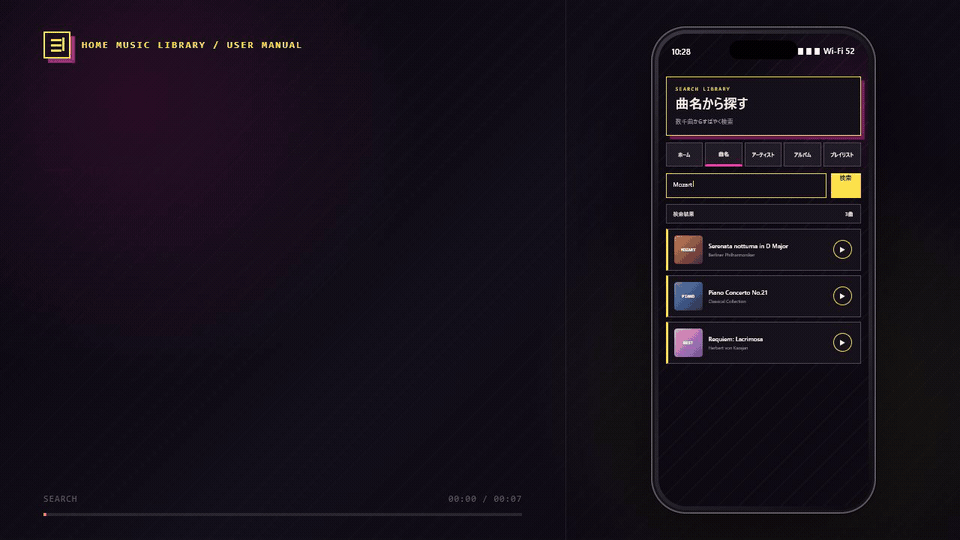
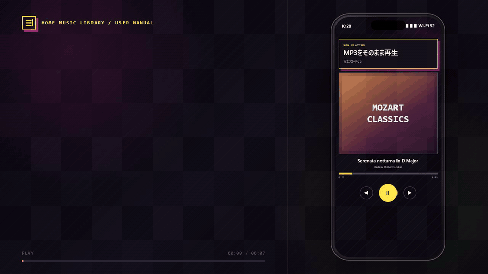
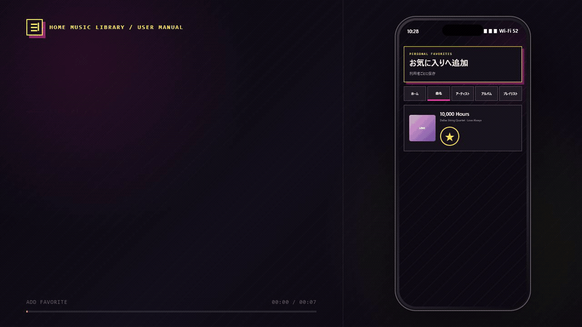
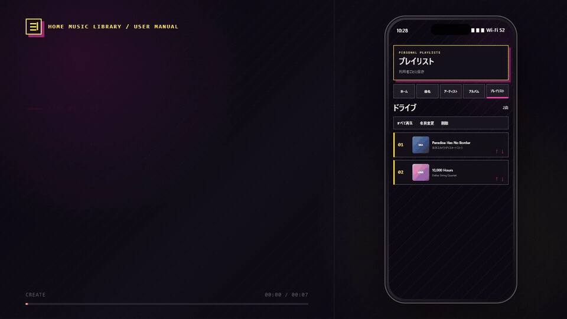
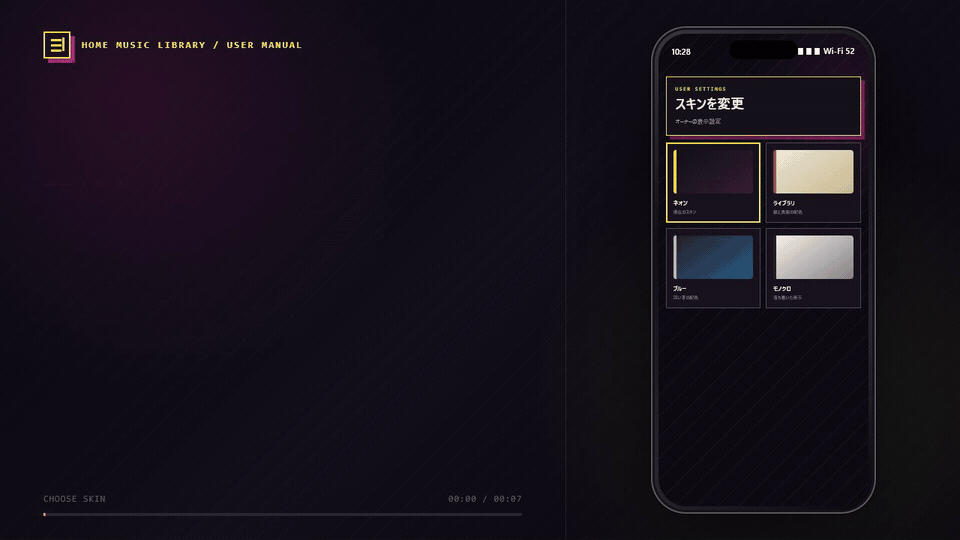
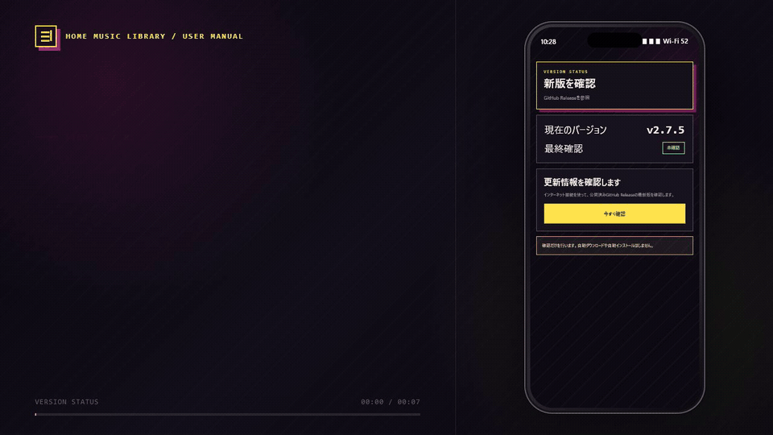

# 利用マニュアル

> インストーラーの入手から初回設定、Tailscale導入、家族招待までを初めて行う場合は、先に[オーナー導入・家族共有ガイド](19-owner-setup-guide.md)を参照してください。

## 1. インストール・更新

1. 起動中の自宅音楽ライブラリを終了します。
2. `MusicLibrary-Setup-2.7.5-x64.exe`を実行します。
3. 旧版が入っていてもアンインストールせず上書きします。
4. スタートメニューから「自宅音楽ライブラリ」を起動します。

データ保存先:

```text
%LOCALAPPDATA%\MusicLibrary
```

v2.7.4以前からの初回起動ではDBをスキーマ7へ更新し、移行前バックアップを作成します。

## 2. ライブラリ開始

<!-- USER_MANUAL_GIF_START:library-start -->
<p align="center">
  
</p>
<p align="center"><em>ライブラリ開始後は、ホーム画面から最近再生やお気に入りをすぐ開けます。</em></p>
<!-- USER_MANUAL_GIF_END:library-start -->

初回は管理画面でMP3フォルダーを選択し、「ライブラリを開始」を押します。走査完了後、ブラウザが自動で開きます。

起動直後に認証画面で止まった場合は、管理画面の「ブラウザで開く」を押します。v2.7.4以降では自動遷移の安定化を実装しています。繰り返す場合は[トラブルシューティング](08-troubleshooting.md)を参照してください。

## 3. 画面構成

上部タブ:

- ホーム
- 曲名
- アーティスト
- アルバム
- プレイリスト

右上の利用者ボタンから、利用者情報、スキン、バックアップ、新版通知、スマートフォン追加案内を開きます。

## 4. 検索・絞り込み

<!-- USER_MANUAL_GIF_START:search-filter -->
<p align="center">
  
</p>
<p align="center"><em>キーワード検索、索引、お気に入り、並べ替えを組み合わせて目的の曲を探せます。</em></p>
<!-- USER_MANUAL_GIF_END:search-filter -->

- 検索欄へ曲名、アーティスト、アルバム、作曲者を入力
- 索引でA～Z、五十音、漢字・その他を選択
- お気に入りだけを表示
- 曲名、再生回数、追加日等で並べ替え
- アーティスト→アルバム→曲へ移動

## 5. 再生

<!-- USER_MANUAL_GIF_START:playback -->
<p align="center">
  
</p>
<p align="center"><em>曲カードから再生し、シーク、前後移動、シャッフル、リピートを操作できます。</em></p>
<!-- USER_MANUAL_GIF_END:playback -->

曲カードの再生ボタンを押します。下部プレーヤーで次を操作できます。

- 再生／一時停止
- シーク
- 前の曲／次の曲
- シャッフル
- 全曲リピート
- 1曲リピート
- 音量

MP3は再エンコードしません。

## 6. お気に入り・再生履歴

<!-- USER_MANUAL_GIF_START:favorites-history -->
<p align="center">
  
</p>
<p align="center"><em>お気に入り、再生回数、最終再生日時は認証された利用者ごとに保存されます。</em></p>
<!-- USER_MANUAL_GIF_END:favorites-history -->

認証済み利用者では、お気に入り、再生回数、最終再生日時を個別保存します。他の家族の状態とは混ざりません。匿名接続では保存しません。

## 7. プレイリスト

<!-- USER_MANUAL_GIF_START:playlists -->
<p align="center">
  
</p>
<p align="center"><em>プレイリストを作成し、曲順を調整して、そのまままとめ再生できます。</em></p>
<!-- USER_MANUAL_GIF_END:playlists -->

### 作成

1. 「プレイリスト」タブを開く
2. 「新しいプレイリスト」を押す
3. 名前を入力する

### 曲の追加

1. 曲名、アーティスト、アルバム画面で曲カードを表示
2. 「＋」を押す
3. 追加先を選ぶ

同じ曲を同じプレイリストへ二重追加できません。

### 編集・再生

- 「すべて再生」
- 名前変更
- 曲順を上／下へ移動
- 曲を外す
- プレイリスト削除

曲を外したりプレイリストを削除しても、MP3と通常の曲一覧は消えません。

## 8. スキン

<!-- USER_MANUAL_GIF_START:skin -->
<p align="center">
  
</p>
<p align="center"><em>スキンを選んでプレビューし、利用者ごとの表示設定として適用できます。</em></p>
<!-- USER_MANUAL_GIF_END:skin -->

利用者ボタン→「スキンを変更」で選択し、「適用する」を押します。利用者ごとに保存され、PCとスマートフォンで共通です。

## 9. バックアップ・復元

<!-- USER_MANUAL_GIF_START:backup-restore -->
<p align="center">
  
</p>
<p align="center"><em>DBバックアップを作成し、必要な時点を選んで次回起動時の復元を予約できます。</em></p>
<!-- USER_MANUAL_GIF_END:backup-restore -->

ローカルオーナーだけが操作できます。

- 「バックアップを作成」でDBを保存
- 復元対象を選び、注意事項を確認
- 復元は次回起動時に実施
- 復元予約は実行前に取り消し可能

スキーマ7ではプレイリストも含みます。MP3そのものはDBバックアップに含みません。

## 10. 新版通知

<!-- USER_MANUAL_GIF_START:update-check -->
<p align="center">
  
</p>
<p align="center"><em>公開済みGitHub Releaseを確認し、更新するか利用者自身で判断できます。</em></p>
<!-- USER_MANUAL_GIF_END:update-check -->

「今すぐ確認」でGitHub Releaseを確認します。自動インストールはしません。通信失敗しても検索・再生には影響しません。

## 11. スマートフォンのホーム画面

<!-- USER_MANUAL_GIF_START:smartphone-home -->
<p align="center">
  
</p>
<p align="center"><em>TailscaleのHTTPS URLをホーム画面に追加すると、専用アイコンから開きやすくなります。</em></p>
<!-- USER_MANUAL_GIF_END:smartphone-home -->

普段使用するTailscaleのHTTPS URLを開いて追加します。

iPhone／iPad:

```text
Safariの共有 → ホーム画面に追加 → 追加
```

Android:

```text
ブラウザメニュー → アプリをインストール
またはホーム画面に追加
```

ホーム画面から起動してもMP3は端末へ保存されません。自宅PCとTailscaleまたはWi-Fi接続が必要です。

## 12. Tailscale利用

<!-- USER_MANUAL_GIF_START:tailscale-remote -->
<p align="center">
  
</p>
<p align="center"><em>ルーターのポートを開けず、Tailscale HTTPS経由で自宅の音楽へ接続します。</em></p>
<!-- USER_MANUAL_GIF_END:tailscale-remote -->

管理画面の外部接続案内に従ってTailscaleとServeを設定します。ルーターのポート開放は行いません。家族は各自のTailscaleアカウントでアクセスし、利用者別状態を分けます。

- iPhone／iPad: [App StoreからTailscaleをインストール](https://apps.apple.com/us/app/tailscale/id1470499037?ls=1)
- Android: [Google PlayからTailscaleをインストール](https://play.google.com/store/apps/details?id=com.tailscale.ipn)

自宅PCへの導入、Serve設定、家族招待の詳しい手順は[オーナー導入・家族共有ガイド](19-owner-setup-guide.md)を参照してください。

## 13. 長いパス

260文字以上の深いフォルダーや長いMP3名も扱えます。ファイル名やタグは変更しません。エラーが出る場合は診断ファイルを確認します。

## 14. アンインストール

Windowsの「インストールされているアプリ」から削除します。安全のため`%LOCALAPPDATA%\MusicLibrary`のDBやバックアップは残ります。不要になった場合だけ、内容を確認して手動削除します。
