# 自宅音楽ライブラリ

## オーナー導入・初期設定・家族共有ガイド

**対象:** Windows 10／11 64bit・自宅音楽ライブラリ v2.7.7
**文書版:** 1.0（2026-08-03）  
**読者:** PCのインストールやネットワーク設定に慣れていないオーナー

印刷・配布用: [Word版オーナーガイド](downloads/music-library-owner-setup-guide-v2.7.7.docx)

> このガイドでは、ダウンロードから家族が外出先で再生できるところまでを、順番どおりに説明します。図中のメールアドレス、PC名、URL、曲名は例です。Windows、GitHub、Tailscaleの画面は更新により少し変わる場合があります。

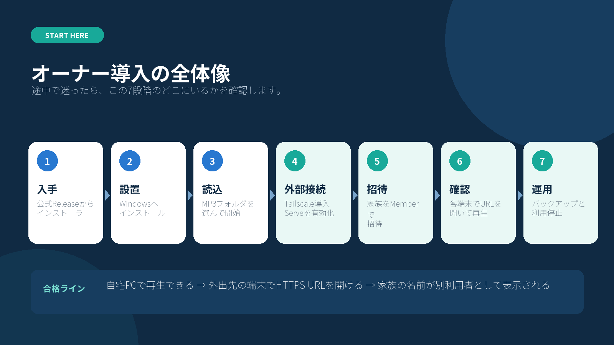

---

## 0. 最初に知っておくこと

### このアプリでできること

自宅PCにあるMP3を、そのPCのブラウザや、Tailscaleで接続したスマートフォン／別PCから検索・再生できます。MP3はアプリへコピーせず、選んだ音楽フォルダを直接読み取ります。

家族ごとに、次の内容を分けて保存します。

- お気に入り
- 再生回数と最終再生日時
- スキン
- プレイリストと曲順

### 必ず守ること

- ルーターのポート開放、DMZ、Tailscale Funnelは使いません。
- Tailscaleのアカウントを家族で使い回しません。1人につき1アカウントを使います。
- 自宅PCが停止、スリープ、ネット切断している間は、外出先から再生できません。
- PWAは音楽を端末へ保存しません。オフライン再生はできません。
- MP3の権利と共有範囲はオーナーが管理します。家庭内の利用を前提にしてください。

### 3種類の利用者

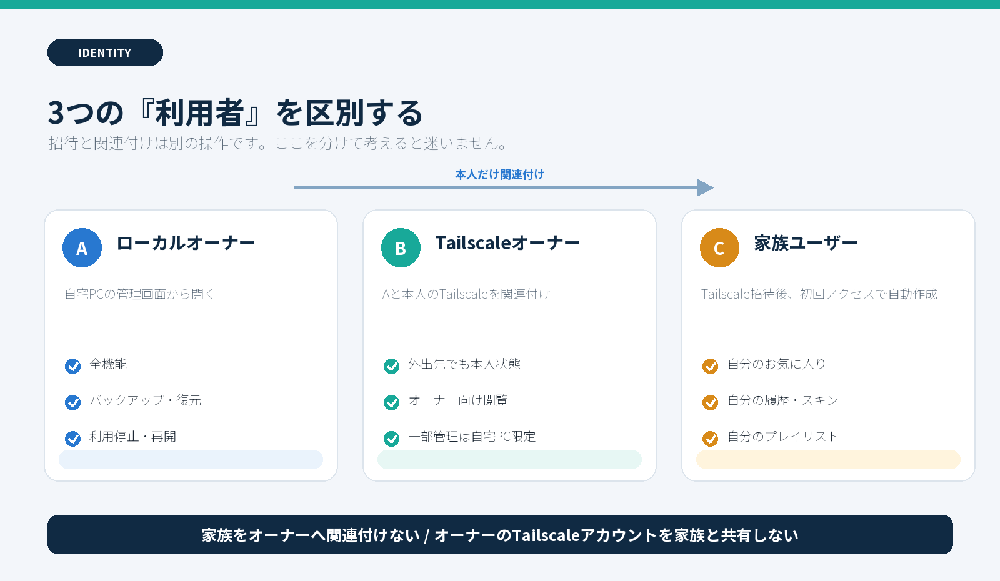

| 種類 | 開き方 | 主な権限 |
|---|---|---|
| ローカルオーナー | 自宅PCの管理画面から「ブラウザで開く」 | 全機能、バックアップ、利用者管理、関連付け承認 |
| Tailscaleオーナー | オーナー本人のTailscaleアカウントでHTTPS URLを開く | 個人機能、オーナー向け閲覧。一部の管理は自宅PC限定 |
| 家族ユーザー | 招待された本人のTailscaleアカウントでHTTPS URLを開く | 自分のお気に入り、履歴、スキン、プレイリスト |

「家族の招待」と「オーナー本人の関連付け」は別の操作です。家族をオーナーへ関連付けないでください。

---

## 1. 用意するもの

作業を始める前に、次を確認します。

- Windows 10／11 64bitの自宅PC
- そのPCへサインインできること
- PC内または外付けドライブに保存されたMP3
- インターネット接続
- オーナー本人が使うGoogle、Apple、Microsoftなどのアカウント（Tailscaleログイン用）
- 招待する家族のメールアドレス
- 家族が使うスマートフォンまたはPC

外付けドライブを音楽フォルダにする場合は、今後も同じドライブ文字（例 `D:`）で接続してください。ドライブを外すと曲を読めません。

### 作業時間の目安

| 作業 | 目安 |
|---|---:|
| ダウンロードとインストール | 10分 |
| 初回スキャン | 数分～数十分（曲数・保存先による） |
| Tailscale設定 | 10～20分 |
| 家族1人の招待と端末設定 | 10～15分 |

---

## 2. インストーラーをダウンロードする

### 2-1. 公式Releaseを開く

ブラウザで次のページを開きます。

<https://github.com/k-systems202208/mp3-source-music-library/releases/tag/v2.7.7>

ページ上部で次を確認します。

- タイトルが「自宅音楽ライブラリ v2.7.7」
- URLの所有者が `k-systems202208`
- `Assets` が表示されている

### 2-2. 2ファイルを取得する

`Assets` 内から次の2ファイルをダウンロードします。

1. `MusicLibrary-Setup-2.7.7-x64.exe`
2. `SHA256SUMS.txt`

ブラウザの右上にあるダウンロードアイコンから、フォルダアイコンを押すと保存場所を開けます。通常は「ダウンロード」フォルダです。

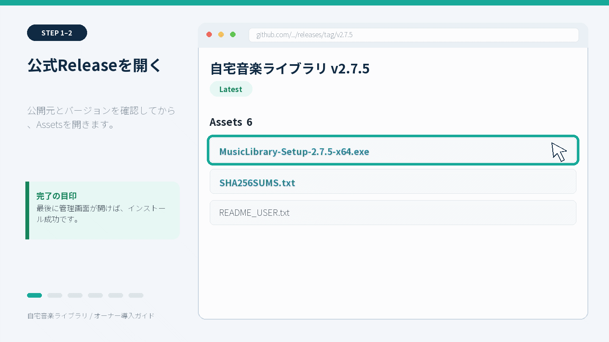

### 2-3. SHA-256を確認する（推奨）

SHA-256は、ダウンロードしたファイルが途中で壊れたり差し替わったりしていないかを確認するための長い文字列です。

1. Windowsのスタートボタンを右クリックします。
2. 「ターミナル」または「Windows PowerShell」を開きます。
3. 次をコピーして貼り付け、Enterを押します。

```powershell
Get-FileHash -Algorithm SHA256 "$env:USERPROFILE\Downloads\MusicLibrary-Setup-2.7.7-x64.exe"
```

4. 表示された `Hash` の64文字と、`SHA256SUMS.txt` 内で同じファイル名の横にある64文字を比較します。

**一致した場合:** 次へ進みます。  
**一致しない場合:** インストーラーを実行せず削除し、公式Releaseから2ファイルをダウンロードし直します。

> ダウンロード済みの同名ファイルがあると、Windowsがファイル名へ `(1)` を付けることがあります。その場合は、実際のファイル名に合わせてコマンドも変更します。

**完了の目印:** 「ダウンロード」フォルダにSetupとSHA256SUMSがあり、ハッシュが一致しています。

---

## 3. Windowsへインストールする

### 3-1. Setupを起動する

1. `MusicLibrary-Setup-2.7.7-x64.exe` をダブルクリックします。
2. ユーザーアカウント制御が表示された場合は、ファイル名と入手元を確認して「はい」を押します。

Windows Defender SmartScreenで「WindowsによってPCが保護されました」と表示される場合があります。次の両方を確認できたときだけ、「詳細情報」→「実行」と進みます。

- 前節の公式Releaseから取得した
- SHA-256が `SHA256SUMS.txt` と一致した

どちらかを確認できない場合は、実行せず前節へ戻ります。

### 3-2. セットアップを進める

1. インストール情報を読み、「次へ」を押します。
2. インストール先は、通常は変更しません。
3. 追加タスクを選びます。

| 追加タスク | おすすめ |
|---|---|
| デスクトップにショートカットを作成 | 好みで選択 |
| Windowsログイン時に自動起動（外部接続を使う場合に推奨） | 家族共有するなら選択 |

「Windowsログイン時に自動起動」を選ぶと、Windowsへサインインしたときに管理画面が起動し、保存済みの音楽フォルダが有効ならライブラリも自動開始します。ただし、PCがスリープやシャットダウン中は使えません。

4. 「インストール」を押します。
5. 「自宅音楽ライブラリを起動」を選んだまま「完了」を押します。

**完了の目印:** 「自宅音楽ライブラリ 2.7.7」の管理画面が開きます。

---

## 4. 初回設定：MP3フォルダを選ぶ

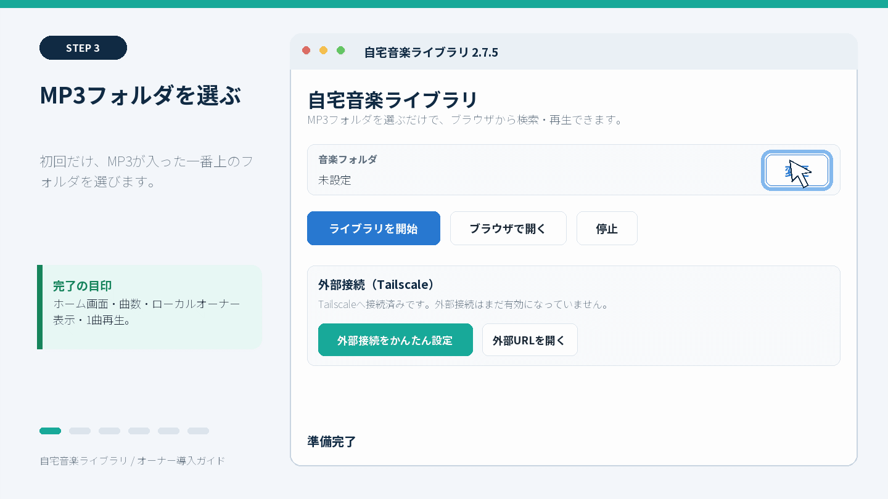

### 4-1. 音楽フォルダを選択する

初回起動では案内が表示され、その後にフォルダ選択画面が開きます。

1. MP3が入っている一番上のフォルダを選びます。
2. 「フォルダーの選択」を押します。

例:

```text
D:\Music
├─ Artist A
│  └─ Album A
└─ Artist B
   └─ Album B
```

この例では `D:\Music` を選びます。下位のフォルダは自動で走査されます。アプリはMP3をコピー、移動、改名、再エンコードしません。

選び直す場合は、管理画面の音楽フォルダ欄にある「変更」を押します。

### 4-2. ライブラリを開始する

1. 「ライブラリを開始」を押します。
2. ログにスキャン状況が出るため、そのまま待ちます。
3. 完了後、ブラウザが自動で開きます。

曲数が多い、外付けHDDが遅い、初めてアートワークを展開する場合は時間がかかります。スキャン中は管理画面を閉じず、外付けドライブも外しません。

### 4-3. ローカルオーナーとして確認する

ブラウザで次を確認します。

- ホーム画面が表示される
- 曲数が想定どおり
- 右上の利用者表示が「ローカルオーナー」またはオーナー表示
- 曲を検索し、1曲再生できる
- シークバーを動かして再生位置が変わる

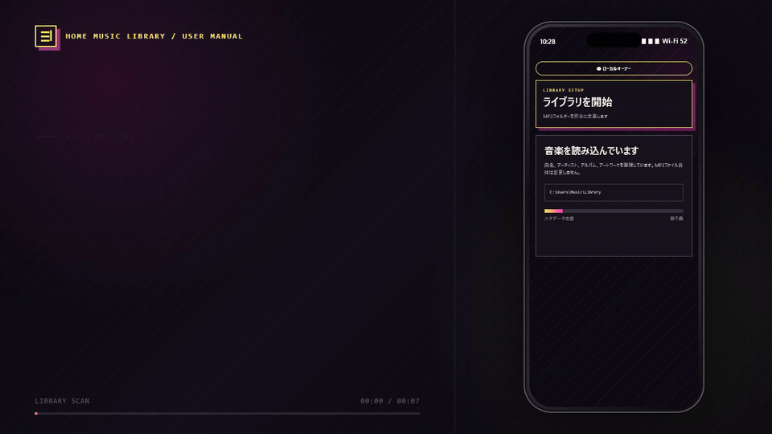

認証画面で止まる、または右上が匿名になる場合は、ブラウザのURLを手入力せず、管理画面の「ブラウザで開く」を押します。このボタンが、ローカルオーナー用の安全な一時認証を渡します。

**完了の目印:** 自宅PCで右上がオーナー表示になり、1曲再生できます。

---

## 5. インストール後のおすすめ設定

### 5-1. PCをスリープさせない（家族共有する場合）

外出先から使う時間帯にPCがスリープすると接続できません。電源接続中だけスリープしない設定が実用的です。

Windows 11の例:

```text
設定 → システム → 電源とバッテリー → 画面、スリープ、休止状態のタイムアウト
```

「電源に接続時、次の時間が経過した後にデバイスをスリープ状態にする」を「なし」にします。Windows 10では表示名が少し異なる場合があります。

> ノートPCは、ふたを閉じたときの動作も確認してください。発熱を避け、通気の良い場所で電源に接続します。

### 5-2. 自動起動を確認する

インストール時に自動起動を選ばなかった場合は、同じインストーラーをもう一度実行し、「Windowsログイン時に自動起動」を選択できます。データはインストール先とは別の次の場所にあるため、上書きインストールでも維持されます。

```text
%LOCALAPPDATA%\MusicLibrary
```

### 5-3. 最初のバックアップを作る

1. 管理画面の「ブラウザで開く」を押します。
2. 右上の利用者ボタンを押します。
3. 「バックアップ・復元」を開きます。
4. 「バックアップを作成」を押します。

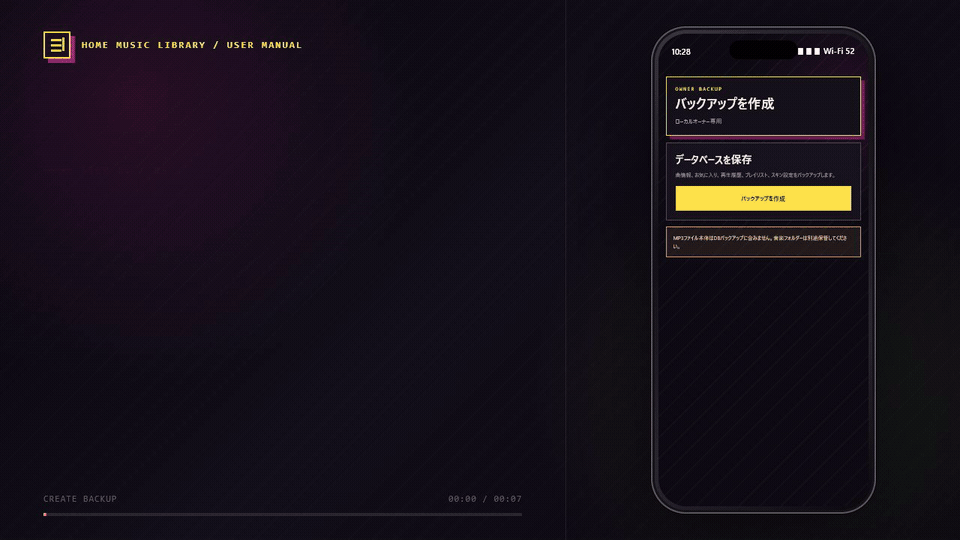

DBバックアップに含まれるもの:

- 曲の検索情報
- 利用者と識別情報
- お気に入り、履歴、再生回数
- スキン
- プレイリスト

含まれないもの:

- MP3本体

MP3は、別の外付けドライブなどへファイルとしてバックアップします。

**完了の目印:** 「バックアップ・復元」に作成日時付きのバックアップが表示されます。

---

## 6. 自宅PCへTailscaleを導入する

Tailscaleは、自宅PCと許可された端末だけを安全につなぐために使います。本アプリの管理画面が設定を補助するため、コマンド入力は不要です。

公式手順: <https://tailscale.com/docs/install/windows>

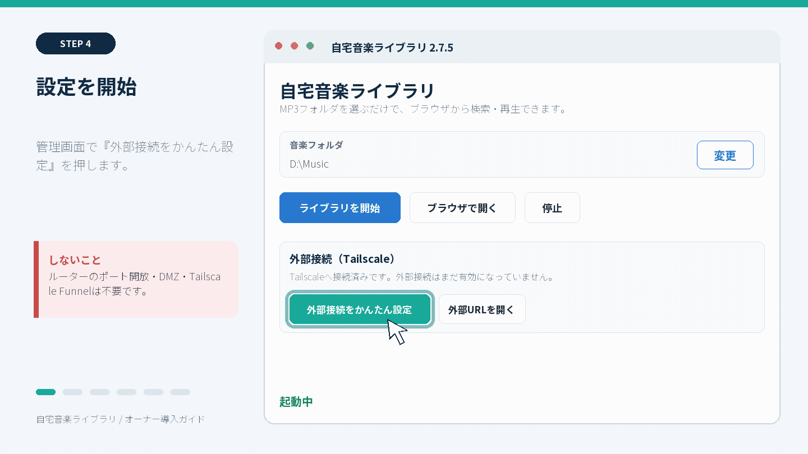

### 6-1. 公式ダウンロードページを開く

1. 自宅音楽ライブラリが「起動中」であることを確認します。
2. 管理画面の「外部接続をかんたん設定」を押します。
3. 「Tailscale公式のダウンロードページを開きますか？」と表示されたら「はい」を押します。
4. 開いた公式ページからWindows版をダウンロードします。

直接開く場合: <https://tailscale.com/download/windows>

### 6-2. Tailscaleをインストールする

1. ダウンロードしたTailscaleの `.exe` を実行します。
2. インストールが終わるまで待ちます。
3. Windows右下の通知領域にTailscaleアイコンが出ます。
4. 見えない場合は、通知領域の `∧` を押します。

### 6-3. オーナー本人のアカウントでログインする

1. Tailscaleアイコンを右クリックします。
2. 「Log in」を押します。
3. ブラウザが開いたら、オーナー本人のGoogle、Apple、Microsoft等のアカウントでサインインします。
4. 接続の確認画面が出たら許可します。
5. Tailscaleアイコンの状態が接続済みになったことを確認します。

初めてTailscaleへログインした端末が、オーナーのtailnet（Tailscale内のプライベートネットワーク）になります。

**完了の目印:** 自宅PCのTailscaleが `Connected` または接続済みです。

---

## 7. Tailscale Serveを有効にする

### 7-1. かんたん設定をもう一度押す

1. 自宅音楽ライブラリの管理画面へ戻ります。
2. 「外部接続をかんたん設定」をもう一度押します。
3. 「Tailscale Serveを設定しています…」の間は待ちます。

初回だけ、ブラウザでServe利用の許可ページが開く場合があります。

1. 内容を確認し、Serveを許可します。
2. 管理画面へ戻ります。
3. 「外部接続をかんたん設定」をもう一度押します。

成功すると管理画面に次のようなHTTPS URLが表示され、自動でブラウザが開きます。

```text
https://music-pc.example.ts.net/music-library-search.html
```

実際のURLは各環境で異なります。管理画面の「外部URLを開く」でも再表示できます。データ保存先の `remote-url.txt` にも保存されます。

### 7-2. 外出先と同じ条件でテストする

オーナーのスマートフォンへTailscaleをインストールし、同じオーナーアカウントでログインします。

- iPhone／iPad: [App StoreからTailscaleをインストール](https://apps.apple.com/us/app/tailscale/id1470499037?ls=1)
- Android: [Google PlayからTailscaleをインストール](https://play.google.com/store/apps/details?id=com.tailscale.ipn)

次の順で確認します。

1. スマートフォンのTailscaleをONにします。
2. Wi-Fiを一時的にOFFにし、モバイル回線へ切り替えます。
3. 自宅PCに表示されたHTTPS URLをブラウザで開きます。
4. 1曲再生します。
5. シークできることを確認します。
6. 確認後、必要ならWi-FiをONへ戻します。

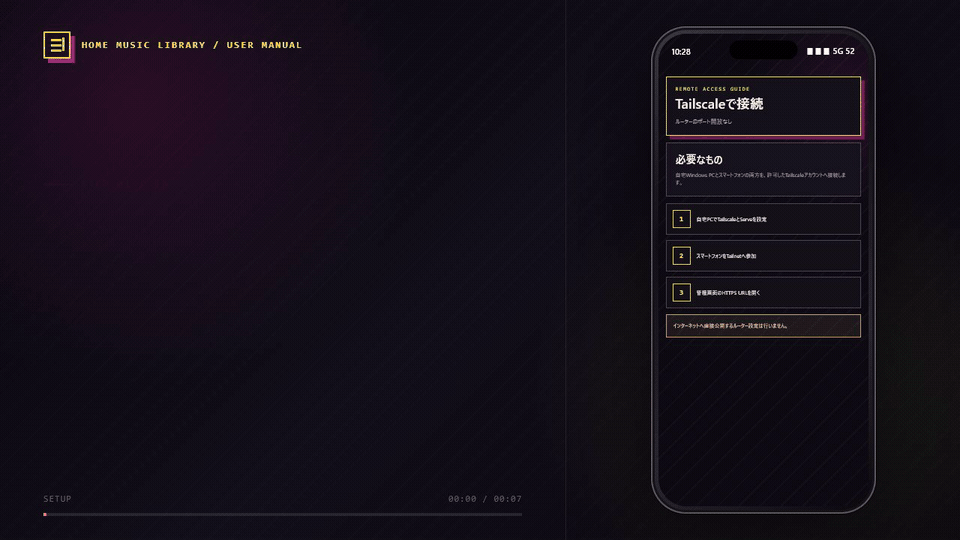

開けない場合は、第14章「トラブルシューティング」の順番で確認します。

**完了の目印:** Wi-FiをOFFにしたスマートフォンでHTTPS URLを開き、1曲再生できます。

---

## 8. 家族をTailscaleへ招待する

ここでは、初心者が管理しやすい「家族をオーナーのtailnetへMemberとして招待する」方法を使います。

Tailscale公式の招待手順: <https://tailscale.com/docs/features/sharing/how-to/invite-any-user>

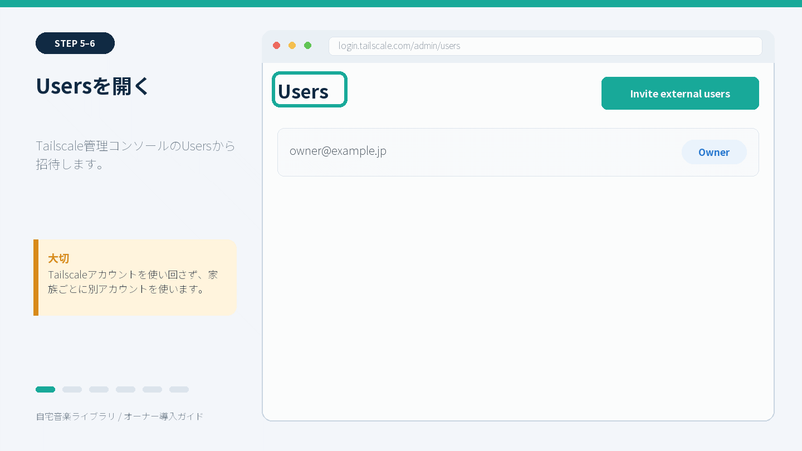

### 8-1. 招待を送る

1. オーナーがTailscale管理コンソールを開きます。  
   <https://login.tailscale.com/admin/users>
2. `Users` ページで `Invite external users` を押します。
3. 家族本人のメールアドレスを入力します。
4. Roleは `Member` を選びます。
5. `Invite` を押します。

メールではなく招待リンクを作る場合は、`Copy invite link` タブでRoleを `Member` にし、生成したリンクを本人だけへ送ります。招待リンクは一回限りで、未使用なら30日で期限切れになります。公開チャットやSNSへ貼らないでください。

### 8-2. 家族が招待を受ける

家族本人が操作します。

1. 招待メールまたは招待リンクを開きます。
2. 家族本人のGoogle、Apple、Microsoft等でTailscaleへサインインします。
3. 招待先のtailnet名を確認します。
4. 招待を承認します。

Tailscaleの利用規約上も、1つのTailscaleユーザーアカウントを複数人で共用しません。家族ごとに別アカウントを使うことで、アプリも別利用者として識別できます。

### 8-3. 招待方式のセキュリティ上の注意

tailnetへ招待したMemberは、Tailscaleのアクセスルールで許された端末やサービスへ接続できます。tailnetに音楽PC以外の重要な端末が多数ある場合は、アクセスルールを設定するか、特定PCだけを共有する「machine sharing」を検討してください。

公式比較: <https://tailscale.com/docs/reference/inviting-vs-sharing>

このガイドでは、家庭用tailnetでオーナーが構成を把握しやすいMember招待を基本手順としています。

**完了の目印:** Tailscale管理コンソールのUsersに、家族がMemberとして表示されます。

---

## 9. 家族の端末を設定する

### 9-1. Tailscaleを入れて接続する

家族本人のスマートフォンまたはPCで操作します。

1. 端末に合わせてTailscaleをインストールします。
- iPhone／iPad: [App Storeからインストール](https://apps.apple.com/us/app/tailscale/id1470499037?ls=1)
- Android: [Google Playからインストール](https://play.google.com/store/apps/details?id=com.tailscale.ipn)
- PC: [Tailscale公式ダウンロード](https://tailscale.com/download)
2. 招待を受けた本人のアカウントでログインします。
3. オーナーのtailnetへ接続していることを確認します。
4. TailscaleをONにします。

### 9-2. 自宅音楽ライブラリを開く

1. オーナーから共有されたHTTPS URLを開きます。
2. 画面右上の利用者名を確認します。
3. 家族本人の名前が表示されていれば成功です。
4. 1曲再生します。
5. お気に入りを1曲付けます。
6. プレイリストを1つ作ります。

アプリ専用のID、パスワード、利用者登録画面はありません。信頼されたTailscale Serveから初めてアクセスしたとき、そのTailscaleアカウントがアプリの利用者として自動作成されます。

オーナーは自宅PCで次を確認します。

```text
管理画面 → ブラウザで開く → 右上の利用者ボタン → 利用者管理
```

家族の名前と `Tailscale` の識別情報が表示されれば正常です。

### 9-3. ホーム画面へ追加する

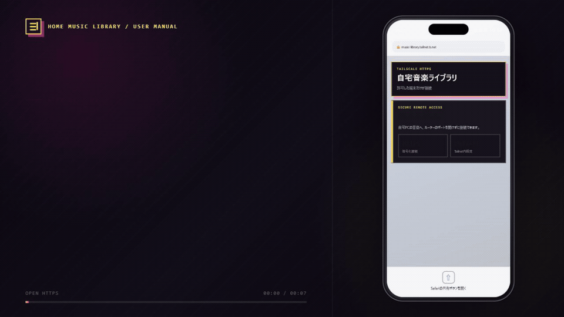

iPhone／iPad:

```text
SafariでHTTPS URLを開く → 共有 → ホーム画面に追加 → 追加
```

Android:

```text
ブラウザでHTTPS URLを開く → メニュー → アプリをインストール
または ホーム画面に追加
```

必ずTailscaleのHTTPS URLを開いた状態で追加します。ローカルURL `127.0.0.1` を追加しても、スマートフォンからは使えません。

**完了の目印:** 家族端末の右上に本人の名前が表示され、再生・お気に入り・プレイリストを使えます。

---

## 10. オーナー本人のTailscaleアカウントを関連付ける

この操作は任意ですが、オーナーが自宅PCと外出先で同じお気に入り・履歴を使うために推奨します。**家族には行いません。**

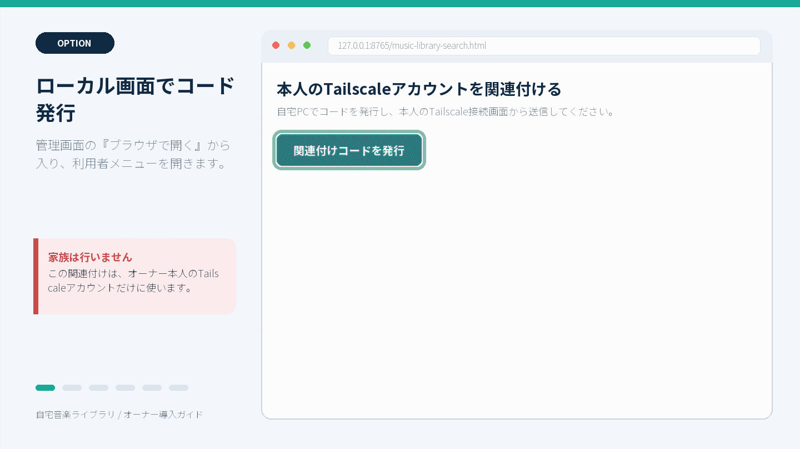

### 10-1. 自宅PCでコードを発行する

1. 自宅PCの管理画面で「ブラウザで開く」を押します。
2. 右上の利用者ボタンを押します。
3. 「本人のTailscaleアカウントを関連付ける」を探します。
4. 「関連付けコードを発行」を押します。
5. 表示されたコードを「コピー」します。

コードは5分で期限切れになります。期限切れなら新しいコードを発行します。

### 10-2. Tailscale側からコードを送る

1. オーナー本人のTailscaleアカウントで、HTTPS URLを開きます。
2. 右上の利用者ボタンを押します。
3. 「このTailscaleアカウントをオーナーへ関連付ける」を探します。
4. 「関連付けコードを貼り付け」へコードを入れます。
5. 「コードを送信」を押します。

送信しただけではオーナーになりません。次の自宅PC側承認が必要です。

### 10-3. 自宅PCで最終承認する

1. 自宅PCのローカルオーナー画面へ戻ります。
2. 候補の表示名とTailscale識別情報が本人であることを確認します。
3. 個人状態の統合件数を確認します。
4. 「この本人を承認」を押します。
5. 最終確認で、間違いなければOKを押します。

Tailscale側で既に作ったお気に入りや再生回数がある場合、ローカルオーナー側へ統合されます。本人でない候補が出た場合は「中止」を押してください。

### 10-4. 完了を確認する

オーナー本人のTailscale HTTPS URLを開き直し、右上が「（オーナー）」表示になり、自宅PCと同じお気に入りが見えることを確認します。

**完了の目印:** ローカル接続とTailscale接続の両方で、オーナー本人の個人状態が一致します。

---

## 11. 共有後の日常運用

### 毎日

- 自宅PCが起動し、Windowsへサインイン済みであること
- 管理画面が「起動中」であること
- 外付けドライブを使う場合は接続されていること
- 外部接続欄が「有効」であること

### 毎月、または大きな変更前

- アプリのDBバックアップを作成
- MP3フォルダを別ドライブへバックアップ
- TailscaleのUsersとMachinesに不要な人・端末がないか確認
- Windows Update後に、モバイル回線から1曲再生できるか確認

### 終了するときの違い

| 操作 | 結果 |
|---|---|
| 「外部接続を停止」 | Tailscale経由だけ停止。自宅PC内のライブラリは動いたまま |
| 「停止」 | 音楽ライブラリを停止。自宅PCと外部の両方で利用不可 |
| 管理画面を閉じる | 確認後、動作中のライブラリも停止 |
| PCをスリープ／シャットダウン | 外部から利用不可 |

---

## 12. 家族の利用を停止・再開する

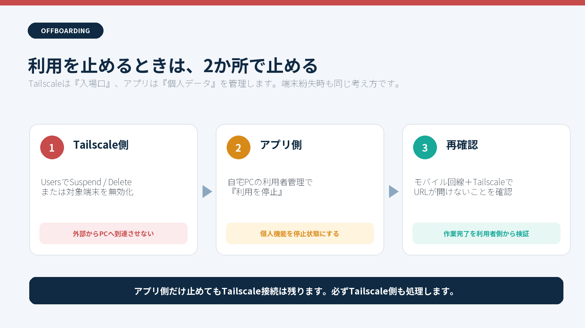

家族が使わなくなった、端末を紛失した、誤って招待した場合は、2か所で対応します。

### 12-1. Tailscale側で止める

1. Tailscale管理コンソールのUsersを開きます。
2. 対象ユーザーのメニューからSuspendまたはDeleteを選びます。
3. 端末紛失の場合はMachinesでも対象端末を無効化／削除します。

公式手順: <https://tailscale.com/docs/features/sharing/how-to/remove-team-members>

### 12-2. アプリ側で止める

1. 自宅PCの管理画面から「ブラウザで開く」を押します。
2. 右上の利用者ボタンを押します。
3. 「利用者管理」で対象の名前と識別情報を確認します。
4. 「利用を停止」を押します。
5. 確認画面でOKを押します。

再び使わせる場合は「利用を再開」を押します。アプリは利用者を完全削除せず、停止・再開で管理します。オーナー自身は停止できません。

**完了の目印:** Tailscale側で接続できず、アプリ側の対象ユーザーが「停止中」です。

---

## 13. 更新・上書きインストール

新しい版へ更新するときは、旧版を先にアンインストールしません。

1. ローカルオーナー画面でDBバックアップを作ります。
2. 管理画面で「停止」を押します。
3. 管理画面を閉じます。
4. 新版の公式ReleaseからSetupとSHA256SUMSを取得します。
5. SHA-256を比較します。
6. 新版Setupを実行し、そのまま上書きします。
7. 起動後に、版、曲数、利用者、お気に入り、プレイリストを確認します。
8. モバイル回線から1曲再生します。

データは `%LOCALAPPDATA%\MusicLibrary` にあるため、通常の上書き更新で維持されます。v2.7.4以前からv2.7.5への更新では、DBスキーマ移行前バックアップも自動作成されます。

---

## 14. トラブルシューティング

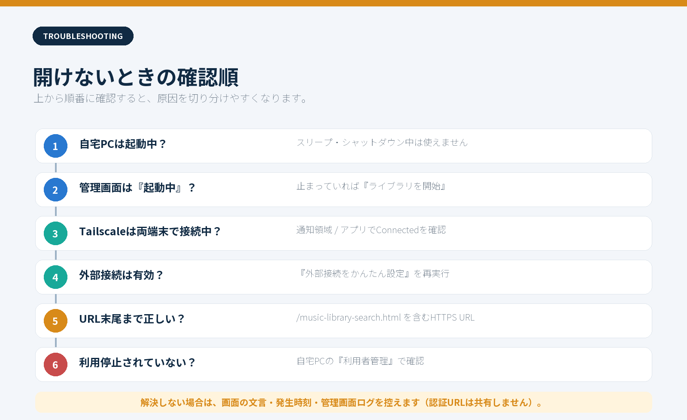

### A. 自宅PCでも画面が開かない

1. 管理画面が開いているか確認します。
2. 音楽フォルダのパスが実在するか確認します。
3. 外付けドライブなら接続とドライブ文字を確認します。
4. 「ライブラリを開始」を押します。
5. 起動後、「ブラウザで開く」を押します。

### B. 右上が匿名になる

- 自宅PCでは、管理画面の「ブラウザで開く」から開き直します。
- 外部端末では、TailscaleがONで本人のアカウントへログイン済みか確認します。
- ブックマークが古いローカルURLでないか確認します。

### C. スマートフォンだけ開けない

1. 自宅PCが起動中か確認します。
2. 自宅PCのTailscaleが接続済みか確認します。
3. スマートフォンのTailscaleが接続済みか確認します。
4. HTTPS URLを最後の `/music-library-search.html` までコピーし直します。
5. 管理画面の「外部接続をかんたん設定」をもう一度押します。
6. 家族なら、TailscaleのUsersで招待承認済みか確認します。
7. アプリの利用者管理で「停止中」になっていないか確認します。

### D. Tailscaleの許可ページが何度も開く

1. 許可ページでServeを許可します。
2. 許可完了画面を確認します。
3. 自宅音楽ライブラリの管理画面へ戻ります。
4. 「外部接続をかんたん設定」をもう一度押します。

### E. 曲が少ない／再生できない曲がある

- 選択した一番上の音楽フォルダが正しいか確認します。
- MP3が別ドライブや別フォルダへ移動していないか確認します。
- 外付けドライブの接続を確認します。
- 管理画面のログとデータ保存先の診断ファイルを確認します。

### F. 問い合わせ時に控える情報

- アプリ版（例 2.7.7）
- Windows 10／11
- 発生時刻
- どのボタンを押した後か
- 画面に出たエラー文
- 管理画面ログの該当箇所

次は共有しないでください。

- ワンタイム認証トークンを含むURL
- 関連付けコード
- Tailscaleの招待リンク
- Windowsユーザー名や個人フォルダの完全なパス
- 公開したくない曲名、メールアドレス

---

## 15. アンインストール

1. 自宅音楽ライブラリを停止して閉じます。
2. Windowsの「設定」→「アプリ」→「インストールされているアプリ」を開きます。
3. 「自宅音楽ライブラリ」を選び、アンインストールします。

安全のため、利用者データ、DB、バックアップは次に残ります。

```text
%LOCALAPPDATA%\MusicLibrary
```

完全に不要になった場合だけ、内容とバックアップを確認して手動削除します。MP3フォルダはアンインストールしても削除されません。

Tailscaleも使わなくなる場合は、Tailscale管理コンソールでPCと不要ユーザーを処理した後、WindowsからTailscaleをアンインストールします。

---

## 16. 最終チェックリスト

### 自宅PC

- [ ] 公式ReleaseからSetupとSHA256SUMSを取得した
- [ ] SHA-256が一致した
- [ ] 自宅音楽ライブラリ 2.7.7をインストールした
- [ ] MP3フォルダを選び、曲数を確認した
- [ ] ローカルオーナーとして1曲再生した
- [ ] DBバックアップを作った
- [ ] 必要ならWindowsログイン時の自動起動を選んだ
- [ ] 外部利用時間中にPCがスリープしない設定にした

### Tailscale

- [ ] 自宅PCへTailscaleを入れ、オーナー本人でログインした
- [ ] 「外部接続をかんたん設定」を完了した
- [ ] HTTPS URLを安全な場所に保存した
- [ ] ルーターのポート開放、DMZ、Funnelを使っていない
- [ ] モバイル回線から1曲再生した

### 家族共有

- [ ] 家族をMemberで招待した
- [ ] 家族は本人専用のTailscaleアカウントを使った
- [ ] 家族端末でTailscaleが接続済みになった
- [ ] HTTPS URLの右上に家族本人の名前が出た
- [ ] オーナーの「利用者管理」に家族が表示された
- [ ] 家族をオーナーへ関連付けていない

### オーナー本人

- [ ] 必要ならローカルオーナーと本人のTailscaleを関連付けた
- [ ] 本人の表示名・識別情報を確認してから承認した
- [ ] 外出先でも「オーナー」表示と同じお気に入りを確認した

---

## 17. 公式リンク

- 自宅音楽ライブラリ v2.7.7 Release
  <https://github.com/k-systems202208/mp3-source-music-library/releases/tag/v2.7.7>
- Tailscale Windows版のインストール  
  <https://tailscale.com/docs/install/windows>
- Tailscaleへユーザーを招待  
  <https://tailscale.com/docs/features/sharing/how-to/invite-any-user>
- ユーザー招待と端末共有の違い  
  <https://tailscale.com/docs/reference/inviting-vs-sharing>
- Tailscaleユーザーの停止・削除  
  <https://tailscale.com/docs/features/sharing/how-to/remove-team-members>

---

## 文書について

本書の操作ラベルは自宅音楽ライブラリ v2.7.7の実装、同梱文書、公開情報に合わせています。図とGIFは個人情報を含まない再現画面です。Tailscaleの画面・用語は公式サービスの更新によって変わる場合があるため、迷った場合は上記の公式リンクも確認してください。
