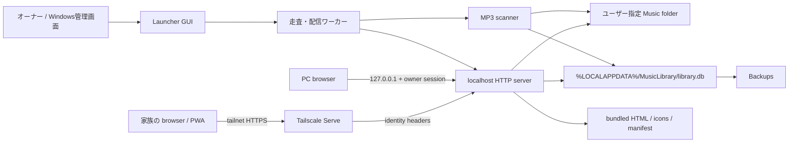
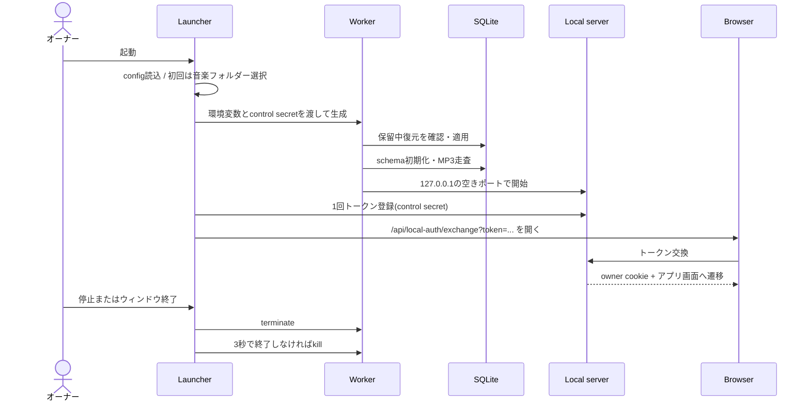
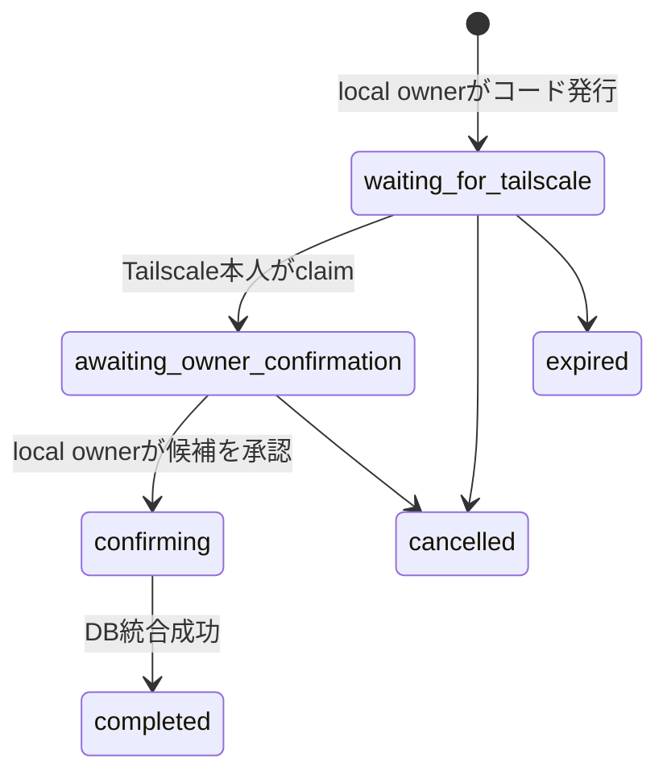
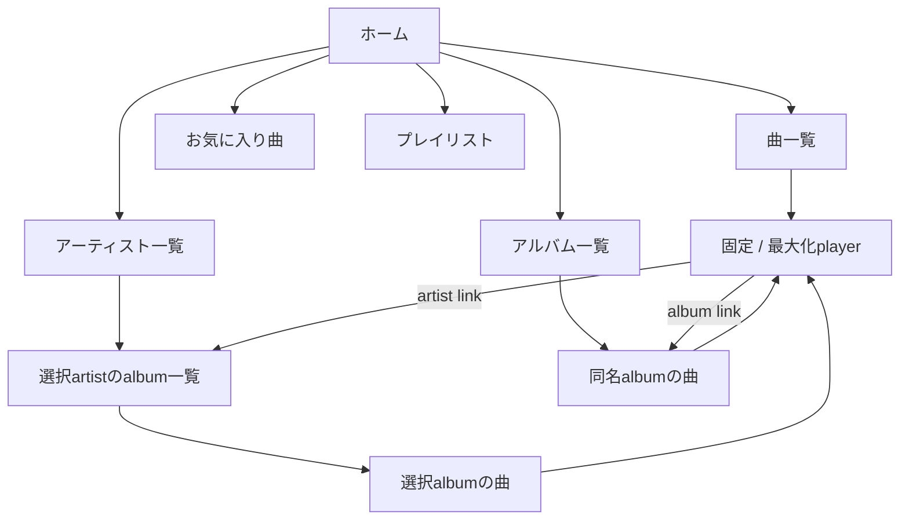

# 自宅音楽ライブラリ v2.7.7 再実装用詳細設計書

文書版: 1.0  
対象アプリ: 自宅音楽ライブラリ v2.7.7  
対象DB: SQLiteスキーマ7  
対象OS: Windows 10 / 11 x64  
作成目的: この文書と指定ソースをプログラマーへ渡し、同じ外部仕様・データ互換性・安全性を持つアプリを再実装できるようにする。

## 1. この文書の位置付け

本書は、製品仕様を説明するだけの概要書ではない。実装担当者が、画面、API、DB、ファイル走査、認証、Tailscale共有、バックアップ、PWA、Windows配布物までを再構築するための実装契約である。

本書で「必須」と記載した仕様は互換実装でも維持する。「推奨」は、外部動作を変えない範囲で別実装へ置き換えてよい。日時は特記がない限りタイムゾーン付きISO 8601文字列、JSONはUTF-8とする。

### 1.1 正規ソース

現行Windows製品の正規ソースは `windows-installer/src/` である。リポジトリ直下にある同名の古いPython／HTMLファイルは履歴資産であり、再実装の正本にしてはならない。

| 対象 | 正規ソース |
|---|---|
| パス・版情報 | `windows-installer/src/paths.py` |
| DB、検索、利用者、プレイリスト | `windows-installer/src/database.py` |
| MP3走査 | `windows-installer/src/generator.py` |
| HTTPサーバー・API | `windows-installer/src/server.py` |
| Windows管理画面 | `windows-installer/src/launcher.py` |
| ローカル認証 | `windows-installer/src/local_auth.py` |
| Tailscale識別 | `windows-installer/src/tailscale_identity.py` |
| オーナー関連付け | `windows-installer/src/owner_link.py` |
| Tailscale Serve操作 | `windows-installer/src/remote_access.py` |
| バックアップ・復元 | `windows-installer/src/backup_restore.py` |
| 新版確認 | `windows-installer/src/update_check.py` |
| 長いWindowsパス | `windows-installer/src/long_paths.py` |
| Web UI | `windows-installer/src/music-library-search.html` |
| PWA | `windows-installer/src/manifest.webmanifest`, `service-worker.js`, `offline.html` |
| PyInstaller | `windows-installer/build/MusicLibrary.spec` |
| Inno Setup | `windows-installer/installer/MusicLibrary.iss` |
| リリースビルド | `windows-installer/00_build_installer.bat`, `.github/workflows/build-windows-release.yml` |

本書とソースが矛盾する場合は、v2.7.7タグ相当の上記正規ソースを優先し、矛盾を文書不具合として修正する。

## 2. 製品の目的と境界

### 2.1 目的

ユーザーが指定した音楽フォルダー配下のMP3を索引化し、PCまたはTailscaleで接続した家族端末のブラウザから、検索、絞り込み、再生、お気に入り、再生履歴、プレイリストを利用できるようにする。

### 2.2 必須の安全原則

- 元のMP3を変更、削除、移動、コピーしない。
- ID3タグへ補正値を書き戻さない。曲名、アーティスト名、アルバム名の変更はDB上の表示overrideとする。
- DB、設定、ログ、バックアップを静的HTTPで公開しない。
- HTTPサーバーは `127.0.0.1` にだけbindする。LAN全体へ直接bindしない。
- 外部共有はTailscale Serveを介し、Tailscaleが付加する本人識別ヘッダーを使用する。
- 個人状態は認証済み利用者ID単位で分離する。
- オーナー限定操作とローカルオーナー限定操作を区別する。
- 復元は実行中DBへ直接上書きせず、次回ワーカー起動時に検査・退避・置換する。

### 2.3 対象外

- MP3以外の音声形式の索引化
- 音楽ファイルの編集、変換、同期、端末へのダウンロード管理
- Tailscaleを使わないインターネット公開
- 複数PC間のDB同期
- クラウドアカウント、パスワード認証、課金
- 未認証利用者の個人履歴保存

## 3. 技術構成

| 層 | v2.7.7実装 | 再実装時の必須条件 |
|---|---|---|
| 管理GUI | Python 3.13 + Tkinter | 同じ操作とライフサイクルを提供 |
| ワーカー | Pythonプロセス | 走査後にHTTPサーバーを開始 |
| HTTP | `ThreadingHTTPServer` + `SimpleHTTPRequestHandler` | localhost限定、Range対応、同じAPI契約 |
| DB | SQLite 3、WAL | スキーマ7とデータ意味を維持 |
| MP3解析 | 同梱Mutagen + フォールバック解析 | ID3、長さ、画像、破損耐性を維持 |
| Web UI | 単一HTML、CSS、vanilla JavaScript | ビルド工程なしで同じ画面・操作を提供 |
| PWA | manifest + Service Worker | UIシェルだけをキャッシュし個人／音楽データを除外 |
| 遠隔接続 | Tailscale Serve | HTTPS URLとTailscale本人識別を使用 |
| 配布 | PyInstaller one-dir + Inno Setup | Windows x64、ユーザー単位インストール |

サーバーは外部WebフレームワークやNode.jsを必要としない。再実装で技術を変更してもよいが、パス、API、DB、安全境界、インストール後の利用手順を互換にする。

## 4. 全体アーキテクチャ



### 4.1 プロセス責務

1. ランチャーは設定、画面表示、ワーカー生成、ブラウザ起動、Tailscale CLI操作を担当する。
2. ワーカーは保留中の復元を最初に適用する。
3. ジェネレーターはMP3を走査してSQLiteを更新する。
4. 走査完了後、ワーカーは空きポートへlocalhostサーバーをbindする。
5. ランチャーはサーバーへ短時間トークンを登録し、交換URLをブラウザで開く。
6. 管理画面終了または「停止」でワーカーを終了する。

### 4.2 信頼境界

| 接続 | 信頼根拠 | 権限 |
|---|---|---|
| 未識別ブラウザ | なし | 閲覧・再生のみ |
| ローカルオーナー | ランチャー発行の1回トークンから得たセッションCookie | オーナー権限 + ローカル限定管理 |
| Tailscale利用者 | Tailscale Serveが付加した本人ヘッダー | 本人の個人機能 |
| 関連付け済みTailscaleオーナー | Tailscale identityがownerレコードへ関連付け済み | オーナー権限。ただし復元等はローカル限定 |

クライアントが任意に送信した利用者IDを信用してはならない。すべての個人APIはサーバーが現在の接続から利用者IDを決定する。

## 5. インストール、保存先、設定

### 5.1 標準パス

| 種別 | 標準値 |
|---|---|
| インストール先 | `%LOCALAPPDATA%\Programs\MusicLibrary` |
| データルート | `%LOCALAPPDATA%\MusicLibrary` |
| DB | `%LOCALAPPDATA%\MusicLibrary\library.db` |
| アートワークキャッシュ | `%LOCALAPPDATA%\MusicLibrary\.artwork-cache` |
| バックアップ | `%LOCALAPPDATA%\MusicLibrary\Backups` |
| 診断出力 | `%LOCALAPPDATA%\MusicLibrary\Exports` |
| ログ | `%LOCALAPPDATA%\MusicLibrary\Logs` |
| 設定 | `%LOCALAPPDATA%\MusicLibrary\config.json` |
| 実行状態 | `%LOCALAPPDATA%\MusicLibrary\runtime.json` |
| ランチャーログ | `%LOCALAPPDATA%\MusicLibrary\Logs\launcher.log` |
| 遠隔URL記録 | `%LOCALAPPDATA%\MusicLibrary\remote-url.txt` |

`MUSIC_LIBRARY_DATA_DIR` でデータルート、`MUSIC_LIBRARY_MUSIC_DIR` で音楽ルートを上書きできる。凍結実行時の静的資産ルートはPyInstallerの `_MEIPASS`、開発時はソースディレクトリである。

### 5.2 `config.json`

```json
{
  "musicRoot": "D:\\Music",
  "port": 8765,
  "remoteUrl": "https://computer-name.tailnet-name.ts.net/music-library-search.html"
}
```

- `musicRoot`: 必須。ユーザーが選択した既存フォルダー。
- `port`: 優先ポート。標準8765。使用中ならOSに空きポートを割り当てさせる。
- `remoteUrl`: 任意。Tailscale Serve設定成功時に記録する。

### 5.3 `runtime.json`

状態は最低限 `scanning`、`scan_completed`、`running`、`error` を表せること。`running` ではPID、ローカルURL、ポートを記録する。異常終了時にもランチャーが古い状態を誤認しないよう、プロセス生存確認を併用する。

### 5.4 仮想URLと物理パス

- `Music/<relative path>` は音楽ルート配下へ解決する。
- `.artwork-cache/<relative path>` はデータルート配下の画像キャッシュへ解決する。
- HTML、manifest、Service Worker、アイコンは静的資産ルートへ解決する。
- URL decode後に正規化し、解決済みパスが許可ルート配下にあることを確認する。
- `..`、別ドライブ、UNCすり抜け、シンボリックリンク等で許可ルート外へ出る要求は拒否する。
- Windowsの260文字超パスはファイルI/O境界でだけ `\\?\` または `\\?\UNC\` 形式へ変換する。DBとAPIには通常の相対パスを保存する。

### 5.5 内部コマンドライン

配布EXEの標準起動はGUIである。開発・ランチャー内部用に次の引数を維持する。

| 引数 | 意味 |
|---|---|
| `--worker` | GUIではなく走査・配信ワーカーとして起動 |
| `--music-root <path>` | 音楽ルート |
| `--data-root <path>` | データルート。標準はLocalAppData |
| `--port <number>` | 優先ポート。ランチャー標準8765 |
| `--no-browser` | 起動後のブラウザ自動表示を抑止 |
| `--scan-only` | 走査完了後にHTTPサーバーを開始せず終了 |
| `--version` | 製品版を表示して終了 |
| `--remote-setup` | Tailscale遠隔設定を実行する内部モード |

`server.py` を単独実行する開発用CLIは `--host` 標準127.0.0.1、`--port` 標準8000。製品ランチャーは必ずlocalhostと優先8765を使う。

## 6. 起動・停止シーケンス



ランチャーGUIは標準780×690、最小700×590を目安とし、音楽フォルダー選択、開始、ブラウザを開く、停止、データフォルダーを開く、Tailscale設定、遠隔URLを開く、Tailscale公開停止、ヘルプ、ログ表示を備える。初回はフォルダー選択後に自動開始する。

ワーカー環境には `MUSIC_LIBRARY_MUSIC_DIR`、`MUSIC_LIBRARY_DATA_DIR`、`PYTHONUTF8=1`、`PYTHONIOENCODING=utf-8`、`PYTHONDONTWRITEBYTECODE=1` とプロセス単位control secretを渡す。

## 7. SQLite設計

### 7.1 接続設定

各接続で次を設定する。

```sql
PRAGMA foreign_keys = ON;
PRAGMA journal_mode = WAL;
PRAGMA synchronous = NORMAL;
PRAGMA busy_timeout = 30000;
```

接続タイムアウトは30秒、行取得形式は列名アクセス可能なRowとする。書き込み処理は例外時rollback、正常時commitする。DB初期化ではスキーマを作成し、段階移行後に `schema_info.schema_version = 7` を保証する。

検索用に決定的関数 `is_latin_only(text)`、`catalog_bucket(text)`、`catalog_sort_key(text)` を登録する。

### 7.2 テーブル一覧

| テーブル | 役割 |
|---|---|
| `schema_info` | スキーマ版・移行フラグ |
| `artists` | 正規化したアーティストマスター |
| `albums` | タイトル＋album artist単位のアルバムマスター |
| `artworks` | 外部／埋め込みアートワーク |
| `tracks` | MP3索引と共有メタデータ |
| `users` | オーナー・家族利用者 |
| `user_identities` | Tailscale等の外部本人識別 |
| `user_track_state` | 利用者別お気に入り・評価・再生状態 |
| `user_preferences` | 利用者別スキン |
| `playlists` | 利用者所有プレイリスト |
| `playlist_tracks` | 曲順付きプレイリスト中間表 |
| `scan_runs` | 走査単位の履歴 |
| `scan_errors` | 走査警告・エラー |

### 7.3 列定義

#### `schema_info`

| 列 | 型・制約 |
|---|---|
| `key` | TEXT PRIMARY KEY |
| `value` | TEXT NOT NULL |

#### `artists`

| 列 | 型・制約 |
|---|---|
| `id` | TEXT PRIMARY KEY。`artist_` + SHA-256先頭24桁 |
| `name` | TEXT NOT NULL。タグ由来原本 |
| `normalized_name` | TEXT NOT NULL UNIQUE |
| `sort_name` | TEXT NOT NULL DEFAULT ''。TSOP等 |
| `display_name_override` | TEXT NULL。オーナー補正 |
| `created_at`, `updated_at` | TEXT NOT NULL |

#### `artworks`

| 列 | 型・制約 |
|---|---|
| `id` | TEXT PRIMARY KEY。`art_` + 安定hash |
| `relative_path` | TEXT NOT NULL UNIQUE |
| `source_type` | TEXT NOT NULL。外部または埋め込みを識別 |
| `source_mp3_path` | TEXT NOT NULL DEFAULT '' |
| `mime_type` | TEXT NOT NULL DEFAULT '' |
| `file_hash` | TEXT NOT NULL DEFAULT '' |
| `created_at`, `updated_at` | TEXT NOT NULL |

#### `albums`

| 列 | 型・制約 |
|---|---|
| `id` | TEXT PRIMARY KEY。正規化titleとalbum artistから生成 |
| `title` | TEXT NOT NULL |
| `normalized_title` | TEXT NOT NULL |
| `album_artist` | TEXT NOT NULL DEFAULT '' |
| `normalized_album_artist` | TEXT NOT NULL DEFAULT '' |
| `sort_title` | TEXT NOT NULL DEFAULT ''。TSOA等 |
| `year` | INTEGER NULL |
| `artwork_id` | TEXT NULL、FK → `artworks.id` |
| `created_at`, `updated_at` | TEXT NOT NULL |

`UNIQUE(normalized_title, normalized_album_artist)` を付ける。

#### `tracks`

| 列群 | 列と仕様 |
|---|---|
| 識別 | `id TEXT PRIMARY KEY`; `relative_path TEXT NOT NULL UNIQUE`; `filename TEXT NOT NULL` |
| 曲名 | `title TEXT NOT NULL`; `normalized_title TEXT NOT NULL`; `sort_title TEXT NOT NULL DEFAULT ''` |
| 関連 | `artist_id TEXT NULL FK`; `album_id TEXT NULL FK`; `artwork_id TEXT NULL FK` |
| タグ | `album_artist`, `genre`, `composer` はTEXT NOT NULL DEFAULT ''; `year`, `track_number`, `disc_number` はINTEGER NULL; `duration_ms INTEGER NOT NULL DEFAULT 0`; `kind TEXT NOT NULL DEFAULT 'MP3オーディオファイル'` |
| ファイル | `file_size INTEGER NOT NULL`; `modified_time_ns INTEGER NOT NULL`; `content_signature TEXT NOT NULL DEFAULT ''`; `audio_file TEXT NOT NULL`; `metadata_source_json TEXT NOT NULL DEFAULT '{}'` |
| 旧共有状態 | `play_count >= 0`; `date_added`; `last_played_at`; `favorite IN (0,1)`; `rating NULLまたは0..5`。スキーマ5以降は新規更新せず移行互換用 |
| 表示補正 | `title_override`, `artist_override`, `album_override` はTEXT NULL |
| 移行 | `legacy_id`, `legacy_match_method` はTEXT NOT NULL DEFAULT '' |
| 状態 | `last_scanned_at TEXT NOT NULL`; `is_available IN (0,1)`; `created_at`, `updated_at` TEXT NOT NULL |

FKは `artist_id → artists`、`album_id → albums`、`artwork_id → artworks`。曲名表示は `title_override > title`、アーティスト表示は `artist_override > artists.display_name_override > artists.name`、アルバム表示は `album_override > albums.title` の優先順とする。

#### `users`

| 列 | 型・制約 |
|---|---|
| `id` | TEXT PRIMARY KEY |
| `display_name` | TEXT NOT NULL |
| `is_owner` | INTEGER NOT NULL DEFAULT 0、0/1 |
| `is_active` | INTEGER NOT NULL DEFAULT 1、0/1 |
| `created_at`, `updated_at` | TEXT NOT NULL |
| `last_seen_at` | TEXT NOT NULL DEFAULT '' |

`is_owner=1` の部分ユニークインデックスによりオーナーは1人だけとする。既定オーナー名は「オーナー」。オーナーは停止不可。

#### `user_identities`

| 列 | 型・制約 |
|---|---|
| `id` | TEXT PRIMARY KEY |
| `user_id` | TEXT NOT NULL FK → users、ON DELETE CASCADE |
| `provider` | TEXT NOT NULL。`local_owner` または `tailscale` |
| `subject` | TEXT NOT NULL。provider内の安定識別子 |
| `provider_display_name` | TEXT NOT NULL DEFAULT '' |
| `profile_picture_url` | TEXT NOT NULL DEFAULT '' |
| `created_at` | TEXT NOT NULL |
| `last_seen_at` | TEXT NOT NULL DEFAULT '' |

`UNIQUE(provider, subject)`。表示名では本人を識別しない。

#### `user_track_state`

| 列 | 型・制約 |
|---|---|
| `user_id` | TEXT、FK → users、ON DELETE RESTRICT |
| `track_id` | TEXT、FK → tracks、ON DELETE RESTRICT |
| `favorite` | INTEGER NOT NULL DEFAULT 0、0/1 |
| `rating` | INTEGER NULL、0..5 |
| `play_count` | INTEGER NOT NULL DEFAULT 0、0以上 |
| `last_played_at` | TEXT NOT NULL DEFAULT '' |
| `created_at`, `updated_at` | TEXT NOT NULL |

主キーは `(user_id, track_id)`。favorite=false、rating=NULL、play_count=0、last_played_at空の行は削除して疎に保つ。

#### `user_preferences`

`user_id TEXT PRIMARY KEY FK → users ON DELETE CASCADE`、`skin_id TEXT NOT NULL`、`updated_at TEXT NOT NULL`。skinは `library`, `midnight`, `neon`, `cyberpunk`, `candy`, `monochrome` のいずれか。

#### `playlists`

`id TEXT PRIMARY KEY`、`user_id TEXT NOT NULL FK → users ON DELETE CASCADE`、`name TEXT NOT NULL`、`normalized_name TEXT NOT NULL`、`created_at`、`updated_at`。`UNIQUE(user_id, normalized_name)`。

#### `playlist_tracks`

`playlist_id`、`track_id`、`position INTEGER NOT NULL CHECK(position >= 0)`、`added_at TEXT NOT NULL`。主キー `(playlist_id, track_id)`、`UNIQUE(playlist_id, position)`。playlist削除はCASCADE、track削除はRESTRICT。

#### `scan_runs` / `scan_errors`

- `scan_runs`: 自動増分ID、開始／完了日時、status、`mp3_files`, `loaded`, `errors`, `cache_hits`、`details_json`。
- `scan_errors`: 自動増分ID、`scan_run_id`、severity、category、relative_path、message、occurred_at。走査削除時CASCADE。

### 7.4 主要インデックス

- tracks: availability、normalized title、artist、album、album内曲順、content signature、mtime、availableとの複合。
- user state: user + play count降順、last played降順、favorite。
- playlists: user + updated降順、曲順、track逆引き。
- scan errors: scan run。

### 7.5 正規化と安定ID

正規化はcasefold後、半角／全角空白、各種ハイフン、長音状記号、アンダースコア、中黒、句読点、引用符、括弧、スラッシュ、コロン等を除去する。安定IDは各構成値を区切り文字 `U+241F` で連結し、UTF-8 SHA-256の16進先頭24桁へ種別prefixを付ける。

新規曲は原則 `mp3_` + 相対パスSHA-256先頭20桁。ファイル移動と判断できた場合は旧IDを維持する。プレイリストIDは `playlist_` + UUID4 hex。

## 8. MP3走査設計

### 8.1 対象検出

- 音楽ルートを再帰走査し、拡張子 `.mp3` を大文字小文字を区別せず対象にする。
- 外部画像は `.jpg`, `.jpeg`, `.png`, `.webp`, `.gif`。
- 優先画像名は `folder`, `cover`, `front`, `albumart`, `small`。同一フォルダーから親フォルダーへ音楽ルートまで探索する。
- Windows長パス対応関数を、走査、stat、読み込み、seek、Mutagen呼び出しへ適用する。

### 8.2 メタデータ取得優先順

1. 同梱MutagenでID3とMPEG情報を取得する。
2. Mutagenが失敗した場合、独自のID3v2／ID3v1および先頭MPEGフレーム解析へフォールバックする。
3. タグ不足時はファイル名とフォルダー名から補完する。

対応ID3フレーム:

| 情報 | フレーム |
|---|---|
| 曲名 | TIT2 |
| アーティスト | TPE1 |
| アルバムアーティスト | TPE2 |
| アルバム | TALB |
| ジャンル | TCON |
| 作曲者 | TCOM |
| トラック番号 | TRCK |
| ディスク番号 | TPOS |
| 年 | TDRC、TYER |
| 曲名読み／並べ替え | TSOT |
| アーティスト読み／並べ替え | TSOP |
| アルバム読み／並べ替え | TSOA |
| 埋め込み画像 | APIC。front cover type 3を優先 |

文字化け候補を採点し、必要な場合だけLatin-1またはCP1252からUTF-8／CP932への再解釈を試す。変換結果が悪化する場合は原文を維持する。

### 8.3 フォールバック規則

- title: ファイル名stem。
- `Artist - Title.mp3` 形式ならartistとtitle候補を分離する。
- album: 直上フォルダー名。
- track number: ファイル名先頭等の番号パターン。
- disc number: `Disc`, `Disk`, `CD` を含むフォルダー名。
- duration: MPEG情報からミリ秒で算出。取得不能なら0。

### 8.4 キャッシュと移動検出

キャッシュhit条件は、既存行のfile sizeとmtime nsが一致し、参照画像が変化せず、並べ替えタグ等の後補完も不要であること。キャッシュhitでも走査時刻とavailable状態を更新する。

内容署名は `file_sizeのASCII + 先頭64KiB + 末尾64KiB` のSHA-256。現在パスに新規MP3が現れ、同じ署名を持つ「今回未検出の旧行」がちょうど1件の場合だけ移動／改名とみなし、IDと個人状態・プレイリスト参照を維持する。0件または複数件なら新規曲として扱う。

### 8.5 走査トランザクション

```text
scan_runをrunningで作成
全tracksをis_available=0にする
MP3ごとに:
  stat → cache判定 → metadata解析 → artwork → master upsert → track upsert
  解析成功または既存行フォールバックならis_available=1
  警告・エラーをscan_errorsへ記録
  250解析件ごとにcommit
  cache進捗は500件単位でcommit
未参照の埋め込み画像キャッシュを削除
診断JSON/CSVを書き出す
scan_runをcompletedまたはcompleted_with_errorsに更新
```

既存MP3の解析に一時的に失敗しても、物理ファイルが存在するなら前回メタデータを保持してavailableにする。アプリ全体を1ファイルの破損で停止させない。

### 8.6 アートワーク

- 埋め込み画像は `.artwork-cache/<track-id>.<ext>` に抽出する。
- 外部画像は音楽ルート内の相対パスとして参照し、コピーしない。
- MIMEとhashを記録する。
- どのtrack／albumからも参照されなくなった埋め込みキャッシュだけを削除する。

### 8.7 旧JSON移行

旧ライブラリJSONの個人状態は、DBに本当に新規追加した曲だけを対象とする。安全な一意一致が成立する場合のみ移行する。代表条件は完全なartist/album/title一致、album+track+duration差4秒以内、一意なsize/duration一致。曖昧な候補は移行しない。

## 9. 検索・一覧処理

### 9.1 表示値

APIのtrackは次の形を返す。値がない数値系表示項目は互換性のため空文字になる場合がある。

```json
{
  "id": "mp3_...",
  "name": "表示曲名",
  "originalName": "タグ曲名",
  "isCorrected": false,
  "artist": "表示アーティスト",
  "originalArtist": "タグアーティスト",
  "artistDbId": "artist_...",
  "isArtistCorrected": false,
  "albumArtist": "",
  "album": "表示アルバム",
  "originalAlbum": "タグアルバム",
  "albumDbId": "album_...",
  "isAlbumCorrected": false,
  "genre": "",
  "composer": "",
  "year": 2026,
  "time": 210000,
  "trackNumber": 1,
  "discNumber": 1,
  "playCount": 3,
  "dateAdded": "2026-08-01T10:00:00+09:00",
  "lastPlayedAt": "2026-08-04T10:00:00+09:00",
  "favorite": true,
  "rating": "",
  "kind": "MP3オーディオファイル",
  "size": 8388608,
  "relativePath": "Artist/Album/01 Song.mp3",
  "audioFile": "Artist/Album/01 Song.mp3",
  "artworkFile": ".artwork-cache/mp3_....jpg",
  "artworkSource": "embedded",
  "metadataSource": {}
}
```

補正フラグはAPI互換用に残るが、v2.7.7 UIに「訂正済み」表示や訂正済みフィルターは出さない。

### 9.2 検索

- 曲表示: 表示曲名、正規化曲名、表示アーティスト、正規化アーティスト、表示アルバム、正規化アルバム、composerを部分一致OR検索。
- アーティスト一覧: アーティストだけを検索。
- アルバム一覧: アーティストとアルバムを検索。
- SQL LIKEは見える文字列、正規化LIKEは句読点等を除いた値へ適用する。
- unavailable曲は通常の一覧へ出さない。

### 9.3 並び順

| sort | 規則 |
|---|---|
| `title` | catalog sort key、表示曲名、表示artist |
| `artist` | 表示artist、表示title |
| `album` | 表示album、disc、track、title |
| `album_order` | disc、track、title、relative path |
| `plays` | 個人play count降順、last played降順、title |
| `recent` | 個人last played降順、play count降順、title |
| `added` | date added／created降順、title |

The/A/An等の先頭冠詞を除いてcatalog sort keyを作る。頭文字分類は `0-9`, `A-Z`, `あ/か/さ/た/な/は/ま/や/ら/わ`, `他`。漢字は読みタグがなければ原則「他」。英数字タイトルのみは、Latin文字を含み、ひらがな・カタカナ・漢字を含まない曲名とする。

### 9.4 ページング応答

```json
{
  "kind": "tracks",
  "items": [],
  "total": 120,
  "trackTotal": 120,
  "totalDurationMs": 24000000,
  "offset": 0,
  "limit": 80,
  "hasMore": true,
  "indexKey": "",
  "indexCounts": {"0-9": 2, "A": 4, "他": 10},
  "favoriteOnly": false,
  "playedOnly": false
}
```

artist itemは `key, display, originalArtist, indexKey, count, albumCount, isCorrected`。album itemは `key, albumId, display, indexKey, count, artists[], artworkFile`。同名アルバムが複数album IDに跨る場合、グローバル一覧の `albumId` は空にして表示名による絞り込みを使う。

### 9.5 ホーム

`recentlyPlayed`, `favorites`, `mostPlayed`, `recentlyAdded` の4セクションを返す。各セクション上限は1..24、標準8。未認証の場合、個人3セクションは空で、recentlyAddedだけを返す。

## 10. HTTPサーバー共通仕様

### 10.1 基本

- server名: `MusicLibrary/SQLiteAPI2.7.7`
- bind: `127.0.0.1` のみ。
- ルート `/` は `302` で `/music-library-search.html` へ移動。
- JSONは `ensure_ascii=false` のcompact形式、Content-Type `application/json; charset=utf-8`。
- JSON request bodyはobjectだけ。上限1MiB。
- POST/PUT/DELETEは認可判定前にbodyを全て読み、Windowsで未読bodyによるconnection resetを避ける。
- 通常アクセスログは抑止し、ランチャーログを走査・起動情報へ集中させる。
- EPIPE、ECONNRESET、ECONNABORTED、Windows 10053/10054/10058は期待されるブラウザ切断として静かに扱う。

### 10.2 ヘッダーとキャッシュ

全応答へ `X-Content-Type-Options: nosniff`、`Referrer-Policy: same-origin`。API、JSON、HTMLは `Cache-Control: no-store`。manifestとService Workerは `no-cache, max-age=0`、Service Workerには `Service-Worker-Allowed: /`。

ローカル認証交換HTMLにはCSP、`X-Frame-Options: DENY`、`Connection: close` を付ける。

### 10.3 静的配信禁止

最低限、`library.db`, `library.db-wal`, `library.db-shm`, `legacy-library-data.json`, Pythonソース、bat、`.db`, `.sqlite`、Backups、Exportsを直接配信しない。要求パスはURL decode後に許可ルート内か検査する。

### 10.4 MP3 Range

- `Range: bytes=start-end`, `bytes=start-`, `bytes=-suffix` の単一区間を受ける。
- 正常な部分配信は206、`Accept-Ranges: bytes`、`Content-Range`、正確なContent-Length。
- 無効／範囲外は416と `Content-Range: bytes */<size>`。
- Rangeなしは200で全体配信。
- 64KiB単位でstreamし、ブラウザのseekに対応する。

## 11. 認証・認可

### 11.1 現在利用者の解決順

1. Tailscale identity headersを検査する。
2. 有効なTailscale本人ならidentityを作成／更新し、そのuserを返す。
3. Tailscale userが停止中ならanonymousを返す。
4. Tailscale identityがなければローカルowner cookieを検査する。
5. 有効なownerかつactiveならlocal ownerを返す。
6. それ以外はanonymous。

```json
{
  "authenticated": true,
  "id": "user_...",
  "displayName": "利用者名",
  "isOwner": false,
  "provider": "tailscale",
  "skinId": "library"
}
```

anonymousは `authenticated=false`, `id=null`, 空display/provider、owner=false、skin=`library`。

### 11.2 ローカルオーナー認証

- ランチャーはプロセス毎に `token_urlsafe(48)` 相当のcontrol secretを生成し、環境変数でサーバーへ渡す。
- 登録APIは `X-Music-Library-Control-Secret` の定数時間比較に成功した場合だけ1回トークンを登録する。
- 1回トークンはURL-safe 32..256文字、標準TTL 60秒、許容10..120秒。生値を保存せずHMAC-SHA256 digestを保持する。
- 交換時にtokenを一度だけ消費し、12時間sessionを発行する。サーバー再起動で失効する。
- Cookie名 `music_library_owner_session`、`HttpOnly; SameSite=Strict; Path=/; Max-Age=43200`。
- localhost HTTPのためSecure属性は付けない。
- `next` は `/music-library-search.html` だけを許可する。
- 交換HTMLは `location.replace`、meta refresh、手動リンク、500ms予備遷移を持ち、tokenを本文へ再掲しない。

### 11.3 Tailscale本人情報

読むヘッダーは `Tailscale-User-Login`, `Tailscale-User-Name`, `Tailscale-User-Profile-Pic`。同名ヘッダー重複、制御文字、過長文字列、不正なRFC 2047を拒否する。subjectはloginをUnicode正規化・casefoldして作り、表示名とは分離する。画像URLは資格情報を含まないHTTP/HTTPSだけを許可する。ログインヘッダーを持たないtagged deviceはanonymous。

Tailscaleヘッダーはlocalhostへ直接アクセスしたクライアントが偽装できるため、Tailscale identityが存在する場合でもサーバーをlocalhost以外へbindしてはならない。

### 11.4 権限表

| 操作 | anonymous | 認証利用者 | owner | local owner |
|---|---:|---:|---:|---:|
| 閲覧・検索・再生 | ✓ | ✓ | ✓ | ✓ |
| 再生回数保存 | 保存しない | 自分 | 自分 | 自分 |
| お気に入り | × | 自分 | 自分 | 自分 |
| プレイリスト | × | 自分 | 自分 | 自分 |
| 自分の表示名・スキン | × | 自分 | 自分 | 自分 |
| 曲／artist／album表示名補正 | × | × | ✓ | ✓ |
| 利用者一覧・診断・新版確認 | × | × | ✓ | ✓ |
| 家族user停止／再開 | × | × | × | ✓ |
| backup作成・復元 | × | × | × | ✓ |
| owner link開始・確認 | × | × | × | ✓ |
| owner link claim | × | Tailscaleのみ | Tailscaleのみ | × |

ownerでないuserへowner対象を隠す場合は404相当、明示的な権限不足は401/403を使う。プレイリストは必ず `(playlist_id, current_user_id)` で取得し、他人の存在を漏らさない。

### 11.5 オーナー関連付け



- 標準TTL 5分、許容1..10分。
- codeは32..256文字。生値は返却時以外に保存せずSHA-256を保持する。
- owner毎に同時challengeは1つ。新規開始で旧challengeを置換する。
- claimだけではownerにしない。ローカルPCで候補のsubject、表示名、個人状態件数を確認して承認する。
- 統合直前に `library-pre-owner-link-*` バックアップを作る。
- 個人状態はfavoriteをOR、play countを加算、last playedは新しい方、片側だけのratingを採用。同一曲で異なる非NULL ratingがある場合は中止する。
- 候補の `user_track_state` をownerへ統合し、claimに使ったTailscale identityだけをownerへ付け替えた後、重複家族userを削除する。候補user所有のplaylistとskin preferenceは外部キーのCASCADEで削除され、ownerへ移さない。このため承認画面は個人状態の統合対象を明示し、必要なplaylistがあれば関連付け前に利用者が確認する。

## 12. HTTP API

### 12.1 エラー形式

```json
{"error":"利用者向けまたは診断用メッセージ"}
```

| status | 用途 |
|---|---|
| 200 | 取得・更新成功 |
| 201 | 作成成功 |
| 202 | 復元予約・claim等の非同期／未完了成功 |
| 400 | JSON、query、入力値不正 |
| 401 | 認証が必要 |
| 403 | owner／local owner／Tailscale条件不足 |
| 404 | 対象なし、または他人所有資源 |
| 409 | 名前重複、関連付け競合等 |
| 410 | owner link期限切れ |
| 416 | Range不正 |
| 500 | 予期しない内部障害 |

### 12.2 取得API

| method / path | 権限 | 入力 | 主な応答 |
|---|---|---|---|
| `GET /api/health` | 公開 | なし | `{ok:true,database:"library.db"}` |
| `GET /api/current-user` | 公開 | なし | 現在利用者 |
| `GET /api/home?limit=8` | 公開 | limit 1..24 | 4ホームセクション |
| `GET /api/browse` | 公開 | 下記query | ページング結果 |
| `GET /api/tracks` | 公開 | なし | 全available track配列。互換用 |
| `GET /api/stats` | 公開 | なし | DB版、曲数、画像数、本人plays/favorites、最新scan |
| `GET /api/playlists` | 認証 | なし | `{viewer,items}` |
| `GET /api/playlists/{id}` | 認証・所有者 | なし | `{viewer,playlist}` |
| `GET /api/users` | owner | なし | viewerと管理用user一覧 |
| `GET /api/backups` | local owner | なし | backup一覧、pending restore、status |
| `GET /api/diagnostics` | owner | なし | app/DB/path/scan/backup診断 |
| `GET /api/update-status?force=1` | owner | force任意 | 現行版、最新版、通知、release URL |
| `GET /api/owner-link/status?code=...` | local owner | code | challenge状態・候補 |
| `GET /api/local-auth/exchange?token=...&next=...` | 1回token | query | Cookie発行HTML |

`/api/browse` query:

| name | 仕様 |
|---|---|
| `view` | `songs`, `artists`, `artist_albums`, `artist_tracks`, `albums`, `album_tracks`。標準songs |
| `q` | 前後空白除去した検索語 |
| `limit` | 1..200、標準80 |
| `offset` | 0以上 |
| `sort` | title/artist/album/album_order/plays/recent/added |
| `artistKey` | artist下位画面に必須 |
| `albumKey` | artist_tracksに必須 |
| `albumTitle` | album_tracksに必須 |
| `indexKey` | 定義済みcatalog bucketのみ |
| `latinOnly` | `1` 等をtrueとして扱う |
| `favoriteOnly` | 認証利用者のfavoriteだけ |
| `playedOnly` | 認証利用者のplay count > 0だけ |
| `correctedOnly` | 後方互換。UIから送らない |

### 12.3 個人操作API

| method / path | body | 応答・規則 |
|---|---|---|
| `POST /api/tracks/{id}/played` | `{}` | `{id,playCount,lastPlayedAt,recorded}`。anonymousはrecorded=false |
| `POST /api/tracks/{id}/favorite` | `{favorite:boolean}` | 明示値を冪等保存 |
| `PUT /api/me/skin` | `{skinId}` | `{skinId,updatedAt}` |
| `PUT /api/me/profile` | `{displayName}` | `{updated:true,user:{...}}` |

表示名は前後空白除去、連続空白を1個へ変換、1..60文字、U+0000..001F禁止。現在利用者自身の行だけを更新し、Tailscale provider名は変えない。

### 12.4 プレイリストAPI

| method / path | body | 成功応答 |
|---|---|---|
| `POST /api/playlists` | `{name}` | 201 `{created:true,playlist}` |
| `POST /api/playlists/{id}/duplicate` | `{}` | 201 `{created:true,playlist}` |
| `PUT /api/playlists/{id}` | `{name}` | `{updated:true,playlist}` |
| `DELETE /api/playlists/{id}` | なし | `{deleted:true,playlistId}` |
| `POST /api/playlists/{id}/tracks` | `{trackId}` | 201 `{added:true,playlistId,trackId,position}` |
| `DELETE /api/playlists/{id}/tracks/{trackId}` | なし | `{removed:true,playlistId,trackId}` |
| `PUT /api/playlists/{id}/tracks/order` | `{trackIds:[...]}` | `{reordered:true,playlistId,trackIds,unavailableTrackCount,updatedAt}` |

プレイリスト名は空白正規化後1..60文字、制御文字禁止、NFKC+casefoldした名前が同一user内で一意。同じ曲は1回だけ。追加位置はmax+1。削除後は0始まりの連番へ詰める。

並べ替えでは、現在availableな全曲IDを重複なく1回ずつ要求する。unavailable曲は要求配列に含めず、サーバーが末尾へ維持する。一意position制約との衝突を避けるため、いったん全positionへ1,000,000を加算後、0から採番する。

複製名は最初 `元名 のコピー`、衝突時 `元名 のコピー 2` ... `1000`。60文字へ収まるよう元名を切る。新しいplaylist IDへ元の曲順をコピーする。

### 12.5 オーナー操作API

| method / path | 条件 | body |
|---|---|---|
| `POST /api/tracks/{id}/title-correction` | owner | `{value:string|null}` |
| `POST /api/artists/{id}/correction` | owner | `{value:string|null}` |
| `POST /api/albums/{id}/correction` | owner | `{value:string|null}` |
| `POST /api/users/{id}/active` | local owner | `{active:boolean}` |
| `POST /api/backups/create` | local owner | `{}` |
| `POST /api/backups/restore` | local owner | `{backupName,confirmation:"RESTORE"}` |
| `POST /api/backups/restore/cancel` | local owner | `{}` |
| `POST /api/owner-link/start` | local owner | `{expiresInSeconds?}` |
| `POST /api/owner-link/claim` | Tailscale user | `{code}` |
| `POST /api/owner-link/confirm` | local owner | `{code,confirmed:true,userId,subject}` |
| `POST /api/owner-link/cancel` | local owner | `{code}` |

補正値が空、null、または原本と同じならoverrideをNULLへ戻す。artist補正はartist masterへ保存し同artist全曲へ反映する。album補正はスキーマ7互換のため同じalbum_idを持つ全trackの `album_override` へ保存する。MP3タグとalbums.titleを変えない。

ローカルトークン登録は `POST /api/local-auth/token`、control secret header、body `{token,expiresInSeconds}`、成功201 `{registered:true,expiresInSeconds}`。

## 13. Web UI設計

### 13.1 構造

UIは `music-library-search.html` 1ファイルにHTML、CSS、JavaScriptを持つSPAである。初期表示はホーム。主要タブは「ホーム」「曲名」「アーティスト」「アルバム」「プレイリスト」。ページ下部に固定プレーヤー、モーダルとして最大化プレーヤー、利用者・管理画面、プレイリスト追加画面を持つ。

### 13.2 SPA状態

```javascript
{
  view: 'home',
  selectedArtistKey: null,
  selectedArtistLabel: '',
  selectedAlbumKey: null,
  selectedAlbumTitle: '',
  filterLatin: false,
  filterFavoritesOnly: false,
  sort: 'title',
  indexKey: '',
  selectedPlaylistId: null
}
```

検索は入力から250ms debounce。ページサイズ80。IntersectionObserverが下端500px手前へ来たら次ページを取得する。各非同期系列にserial番号を持たせ、古い応答で新しい画面を上書きしない。

### 13.3 画面遷移



アーティスト名とアルバム名は、曲カードおよびプレーヤーでリンクとして表示し、対応一覧へ移動する。編集鉛筆は認証済みownerにだけ描画する。「訂正済み」バッジと訂正済みフィルターは描画しない。

### 13.4 ホーム

- greetingは認証状態と表示名を反映する。
- 統計カードに曲数、アートワーク数、お気に入り等を表示する。
- 主要画面へのquick linkを置く。
- personal sectionは最近再生、お気に入り、よく聴く曲。共有sectionは最近追加。
- anonymousでは個人sectionを隠し、識別方法の案内を表示する。
- 曲カードの再生・favorite変更は一覧側のtrack objectと同期する。

### 13.5 曲・artist・album一覧

- 曲カード: artwork、title、artist link、album link、時間、再生回数、再生、favorite、playlist追加、owner編集。
- artistカード: 表示名、曲数、album数、owner編集。
- albumカード: artwork、表示名、artist群、曲数、owner編集。複数IDに跨る同名albumは個別ID補正を出さない。
- breadcrumbで上位階層へ戻る。
- catalog indexは最上位の曲／artist／album一覧で表示する。
- 曲レベルだけsort、Latin、favorite filterを有効にする。
- 0件、API障害、追加読み込み中、全件読込を別状態で表示する。

### 13.6 プレーヤー

- 単一のHTML `<audio controls preload="metadata">` を固定barとmodalのDOM mount間で移動し、再生を途切れさせない。
- title、artist link、album link、artwork、前、次、shuffle、全体repeat、1曲repeat、閉じる、最大化を提供する。
- 現在一覧の検索queryをplayback contextとして保持する。次／前は同じqueryへlimit=1, offset=Nで取得するため、全曲をメモリ保持しなくてよい。
- playlist再生はtrack ID配列とoffsetをcontextにする。
- 前ボタンは現在位置が5秒超なら同じ曲の先頭へ戻す。5秒以内なら前曲。
- repeat oneはended時に同じ曲を0秒から再生する。repeat allは端で循環する。
- shuffleは現在曲を先頭に、残りoffsetをFisher-Yatesで並べる。全体repeatで次周期を再生成し、可能なら直前曲を周期先頭にしない。
- shuffleとrepeat modeはlocalStorage `music-library-playback-settings-v1` に保存する。
- 再生開始に成功したロードにつき1回だけplayed APIを呼ぶ。
- Media Session APIがあればmetadataとplay/pause/previous/next handlerを設定する。
- 音声／画像エラーはプレーヤー内へ表示し、画面全体を停止させない。

### 13.7 プレイリスト

- 認証済みuserだけ利用可能。左に本人のplaylist一覧、右に選択内容。
- create、rename、duplicate、delete、全曲再生、曲追加／削除、順序変更を提供する。
- PCはドラッグ&ドロップ。drop位置は対象カードの縦中央より前／後で決める。
- タッチ、キーボード、アクセシビリティ用に上／下ボタンも残す。
- API更新失敗時はローカル並びを確定せず、サーバー内容を再取得する。
- 曲追加modalでは既存playlist選択と「新規作成して追加」を提供する。

### 13.8 利用者・管理モーダル

全利用者:

- 現在の表示名、provider、owner状態。
- 自分の表示名変更。
- 6種類のskin preview／適用／cancel。
- PWA追加方法と現在URL。
- anonymousには個人機能が使えない理由。
- Tailscaleの非ownerには関連付けcode入力。

ownerのみ:

- 登録利用者一覧。
- 管理・診断。
- 新版確認。

local ownerのみ:

- owner link code発行・最終承認。
- 家族user停止／再開。
- backup作成・復元予約。

### 13.9 スキン

`html[data-skin]` のCSS custom propertiesで全体配色を切り替える。

| ID | 表示名 | 基本意匠 | theme color |
|---|---|---|---|
| library | ライブラリー | 紙、カード目録、深緑、真鍮 | `#24392b` |
| midnight | ミッドナイト | 深い紺色 | `#101c2e` |
| neon | ネオン | 黒、cyan、magenta glow | `#041219` |
| cyberpunk | サイバーパンク | 黒、yellow、magenta、角形 | `#16131d` |
| candy | キャンディー | pink、cyan、yellow、丸形 | `#ff4f9a` |
| monochrome | モノクローム | 白黒gray、角形 | `#111111` |

skinカード選択は即時previewするがDBへ保存しない。「適用」で現在userの設定をPUTし、cancel／ribbon resetでcommitted skinへ戻す。monochromeではartworkもCSSでgrayscale表示する。dark 3種は `color-scheme: dark`。`prefers-reduced-motion: reduce` では不要なanimationを止める。

### 13.10 レスポンシブ・アクセシビリティ

- 主なbreakpointは720px、700px、600px。
- 小画面では操作を縦積み、playlistを1列化、固定playerを収め、タップ領域を確保する。
- modalは `role=dialog`, `aria-modal=true`、closeラベルを持つ。
- favorite、再生mode、選択tabは `aria-pressed` 等で状態を表す。
- Escapeは最前面のplaylist追加 → user → player modalの順で閉じる。
- artworkには装飾／内容に応じたalt、live messageには `aria-live` を使う。

## 14. バックアップ・復元

### 14.1 バックアップ

- SQLite backup APIを使用し、一貫したDBコピーを作る。
- 手動名: `library-manual-YYYYMMDD-HHMMSS[-NN].db`。
- 移行前: `library-pre-v2.7.0-*`, `pre-v2.7.2-*`, `pre-v2.7.5-*`。
- owner統合前: `library-pre-owner-link-*`。
- 復元前: `library-pre-restore-*`。
- 各候補へ `PRAGMA quick_check` を実行し、schema 5, 6, 7だけを受け入れる。
- backupファイル名は `library-[A-Za-z0-9._-]+.db` かつBackups直下へ解決できるものだけ。

### 14.2 復元

復元APIは即時置換せず、`restore-request.json` を作り202を返す。確認文字列は厳密に `RESTORE`。次回ワーカー起動時:

1. requestの名前と格納先を再検査。
2. 選択backupをquick_check／schema検査。
3. 現DBをpre-restore backupへ退避。
4. 選択DBを `library.restore.tmp.db` へSQLite backup APIで複製。
5. tempを再検査。
6. 現DB接続前に `library.db-wal` と `library.db-shm` を除去。
7. `os.replace` 相当でDBを原子的に置換。
8. 置換後DBを検査し、`restore-status.json` へ成功を記録。
9. 失敗時はpre-restoreからrollbackし、失敗状態を記録。

保留要求はcancel APIで削除できる。UIは現在DB、backup件数／サイズ／最新日時、各backupの有効性、保留中復元を表示する。

## 15. Tailscale連携

### 15.1 実行ファイル検出

`tailscale.exe` をPATH、Program Files配下等から探す。GUI起動用に `tailscale-ipn.exe` も扱う。CLIの不存在時は [Tailscale Windows download](https://tailscale.com/download/windows) を案内する。

### 15.2 状態確認とServe

1. `tailscale status --json`。
2. `BackendState == Running` を確認。
3. `tailscale serve status` から既存HTTPS URLを抽出。
4. 有効化は `tailscale serve --bg <local-port>`。
5. 停止は `tailscale serve off`。
6. CLIが管理者承認URLを返した場合、GUIからブラウザで開けるよう案内する。
7. 公開URLへ `/music-library-search.html` を付け、configとremote-url.txtへ保存する。

Tailscale ServeがHTTPS終端と本人認証を担当し、backendはlocalhost HTTPのままにする。ユーザーがtailnetから外れた場合やServe停止時は遠隔利用できなくてよい。

## 16. PWA

manifestは `id=/music-library`、scope `./`、start URLはアプリHTML、display `standalone`、192/512等のアイコンとskin既定色を持つ。

Service Worker cache版はv2.7.7。HTML、offline page、manifest、favicon、PWA iconだけをshell cacheへ入れる。

次は絶対にcacheしない。

- `/api/`
- `Music/` とaudio拡張子
- `.artwork-cache/`
- Backups、DB、設定
- local-auth exchange
- 個人データを含む応答

navigationはnetwork-first、失敗時にcached app HTML、さらに失敗時offline page。shell資産はcache-first相当。アプリ更新時は古いversion cacheを削除する。

UIはiOS/iPadOS Safari、Android/Chromium、desktop install prompt、standalone状態を判定して手順を出す。PWAは音楽やDBを端末へ保存する機能ではないことを明記する。

## 17. 新版確認

- 対象repository: `k-systems202208/mp3-source-music-library`。
- GitHub Releases APIを `per_page=100` で取得。
- `x.y.z` semverとして比較し、draftは除外、prereleaseは候補に含める。
- 同版にfull releaseとprereleaseがあればfullを優先する。
- cache TTL 24時間、HTTP timeout 5秒。
- 安全なrelease URLはHTTPSかつgithub.comの対象repository配下だけ。
- 通信失敗時はstale cacheがあれば表示し、なければ非致命的errorを返す。検索・再生を停止させない。
- UIの「後で」は `music-library-dismissed-update-<version>` をlocalStorageへ保存する。

テスト用環境変数でcurrent/latest/release URLを上書きできる構造を維持する。

## 18. 診断・ログ・障害処理

### 18.1 管理診断

owner診断は最低限次を含む。

- viewerのproviderとowner/local状態。
- app version、Python version、frozen実行か。
- DB path、size、WAL有無、schema version、`PRAGMA quick_check`、healthy。
- user、active user、identity、track、available track、playlist、playlist track件数。
- 最新scanの開始／完了／status／件数。
- 最新scan errorをseverity別集計し、最大20件をsample表示。
- music/data/backups/logs各path、存在、読み書き可否等。
- backup件数、有効件数、総byte、最新backup、pending restore。

UIの「診断結果を保存」は取得済みJSONをUTF-8ファイルとしてdownloadする。秘密token、Cookie、MP3内容は含めない。

### 18.2 走査診断

ExportsへJSONとCSVを作り、MP3件数、読込、cache hit、metadata parser、artwork、move match、legacy match、warning/errorを集計する。個別errorはseverity/category/relative path/message/timeを持つ。

### 18.3 障害方針

- 1曲の解析失敗はscan全体を中止しない。
- 新版確認、PWA登録、artwork読込失敗は再生・検索を止めない。
- DB不整合、復元失敗、bind失敗はruntime errorとlauncher logに残す。
- UIはHTTP error本文の `error` を優先表示し、取得不能ならstatusを表示する。
- UIの古い非同期応答はserialで破棄する。
- 予期しない例外には操作名と例外型を含めるが、filesystem外部公開を増やさない。

## 19. Windowsビルド・インストーラー

### 19.1 PyInstaller

- entry: `launcher.py`
- one-directory GUI、`console=False`、optimize=1、UPX有効。
- `music-library-search.html`, manifest, Service Worker, offline page, icon、vendor Mutagen、同梱文書を追加する。
- file version/product versionを2.7.7へ揃える。
- 実行時のresource rootは `_MEIPASS` を使う。

### 19.2 Inno Setup

- AppId: `{DDF12346-0D38-4D31-A4AF-27B406C91D8A}`。
- x64 compatible、per-user (`PrivilegesRequired=lowest`)。
- default installは `{localappdata}\Programs\MusicLibrary`。
- Start Menu shortcutを作る。
- 任意taskでdesktop shortcut、自動起動を選べる。
- silent install時は終了後アプリを勝手に起動しない。
- アンインストールでユーザーデータを自動削除しない。

### 19.3 リリースビルド

標準順序:

1. Python 3.13を用意。
2. 全自動testを実行。
3. PyInstallerでone-dirを生成。
4. 生成EXEのversion resourceとsmoke起動を検証。
5. Inno Setupでinstallerを生成。
6. SHA-256 manifestを生成。
7. GitHub Actions artifactへinstaller等をupload。

workflowはmanual `workflow_dispatch`、`windows-latest`、`actions/checkout`、`actions/setup-python`、`actions/upload-artifact` を使用する。action runtimeのdeprecated warningはビルド成否と分けて扱う。

## 20. テスト仕様

### 20.1 自動試験の必須領域

- schema作成、全migration、migration前backup。
- 正規化、catalog bucket、sort tag。
- MP3 parser、fallback、文字化け回復、artwork。
- cache hit、move detection、duplicate signature安全側判断。
- 長いローカル／UNCパス。
- browse query、sort、index、pagination、home。
- Rangeの全形式と416。
- path traversalと禁止静的資産。
- local tokenの登録、1回消費、期限、cookie。
- Tailscale headerの正常／重複／制御文字／不正URL。
- anonymous/user/owner/local-ownerの全権限境界。
- favorite/playbackの利用者分離。
- 表示名、skin、metadata override。
- playlist CRUD、ownership、duplicate、reorder、unavailable曲。
- owner linkの開始、claim、確認、期限、競合、rollback。
- backup検査、予約、次回起動復元、rollback。
- diagnosticsとupdate cache／失敗時fallback。
- Service Workerの除外規則。
- PyInstaller buildとinstaller smoke。

### 20.2 実機受入

1. Windows 10/11 x64へ新規installできる。
2. 初回に音楽folderを選び、長い日本語パスを含むMP3が索引化される。
3. 元MP3のhashとmtimeが走査前後で変わらない。
4. PCブラウザがownerとして開き、owner操作ができる。
5. anonymous URLでは検索・再生できるが個人保存と管理ができない。
6. Tailscale家族userごとにfavorite、history、playlist、skin、表示名が分離する。
7. ownerだけがtitle/artist/album表示名を変更でき、MP3タグは変わらない。
8. playerのartist/album linkが正しい一覧へ移動する。
9. seek、next/previous、shuffle、repeat、Media Sessionが動く。
10. PC dragとmobile上下buttonの両方でplaylist順が保存される。
11. backup作成、復元予約、再起動、復元後検査が成功する。
12. Tailscale Serve HTTPSからPWA追加でき、offline shell以外の音楽・個人応答がcacheされない。
13. 管理診断を表示・保存できる。
14. installerのinstall、更新install、uninstall後データ保持が期待通り。

## 21. 再実装の推奨順序

1. `paths` とデータディレクトリ境界を実装する。
2. schema 7、migration、DB transaction helperを実装する。
3. MP3 parserとscannerを実装し、固定fixtureでDBを生成する。
4. browse/home/statsとRange static serverを実装する。
5. anonymous UIのhome／song／artist／album／playerを実装する。
6. local owner tokenとTailscale identityを実装する。
7. per-user state、profile、skin、playlistを実装する。
8. owner metadata override、user管理、diagnosticsを実装する。
9. owner link、backup/restore、update checkを実装する。
10. Tailscale Serve操作とPWAを実装する。
11. launcher、PyInstaller、Inno Setup、CIを統合する。
12. 自動試験と実機受入を通し、MP3非変更をhashで確認する。

各段階で前段の外部契約を固定し、最後にまとめて認証・path traversalを追加する進め方は避ける。安全境界は最初からtest対象にする。

## 22. 完成判定チェックリスト

以下がすべて成立した時、v2.7.7相当の再実装と判定する。

- [ ] アプリ版2.7.7、schema 7、installer版が一致する。
- [ ] 正規source／resourceだけが配布物へ入る。
- [ ] MP3を一切変更しない。
- [ ] localhost bindとTailscale Serve境界を維持する。
- [ ] DB全13table、制約、主要index、migrationが互換である。
- [ ] scan cache、move detection、artwork、failure継続が動く。
- [ ] 全API path、method、status、body、権限が互換である。
- [ ] anonymous、family user、owner、local ownerを区別する。
- [ ] personal stateとplaylistがuser間で漏れない。
- [ ] 曲・artist・album overrideはownerだけ、表示名は本人だけが変更できる。
- [ ] UIに訂正済み表示／filterを出さない。
- [ ] playerのartist／albumがlinkである。
- [ ] playlistのduplicate、drag、上下、全曲再生が動く。
- [ ] backup/restoreが検査、退避、原子的置換、rollbackを行う。
- [ ] DB、backup、token、personal API responseをstatic／SW cacheで公開しない。
- [ ] Windows長パス、Range、PWA、Tailscale、installerを実機確認する。
- [ ] `docs/09-test-plan.md` の回帰試験と配布物smokeを通す。

## 23. 関連文書

- [アーキテクチャ](01-architecture.md)
- [アプリケーション仕様](02-application-specification.md)
- [モジュール詳細設計](03-detailed-design.md)
- [APIリファレンス](04-api-reference.md)
- [データベース設計](05-database-design.md)
- [運用・セキュリティ](07-operations-security.md)
- [試験計画](09-test-plan.md)
- [ソース検証](15-source-verification.md)
- [要件追跡](16-requirements-traceability.md)
- [v2.7.7実装記録](21-next-update-implementation.md)
- [v2.7.7リリース監査](22-release-audit-v2.7.7.md)
